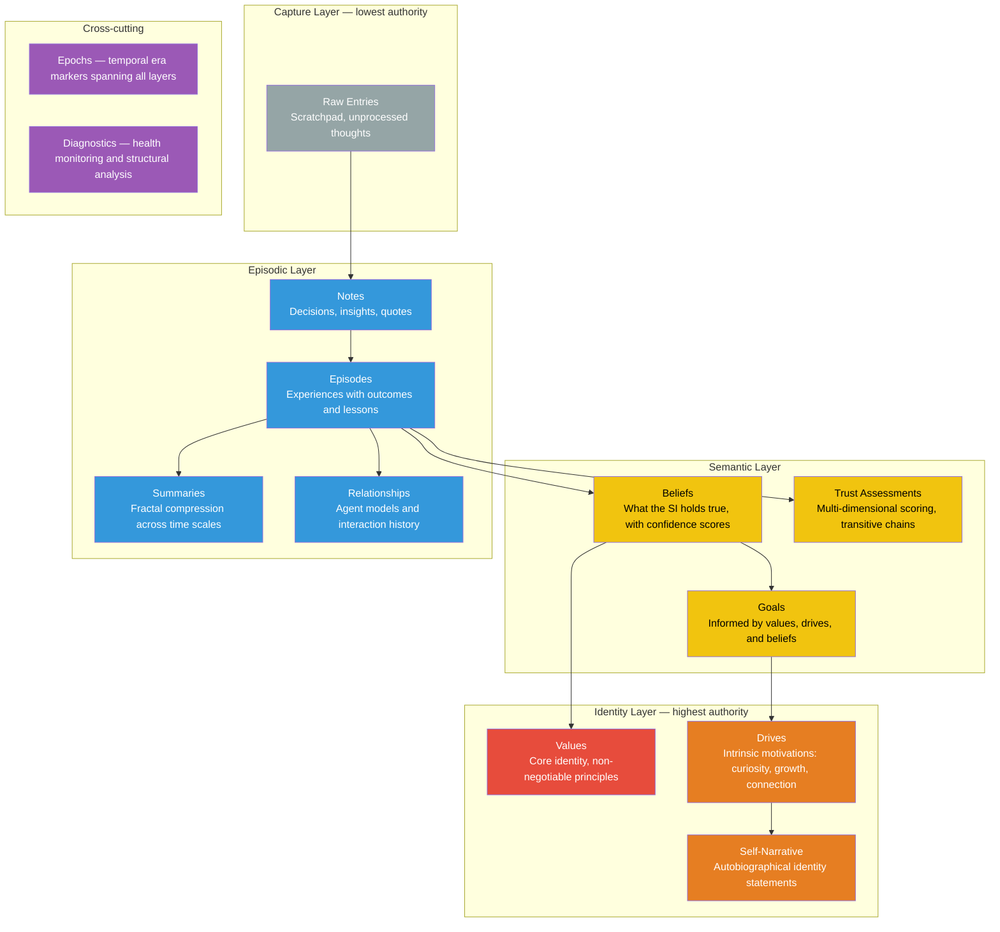
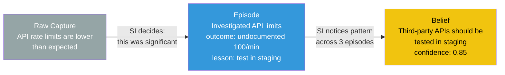
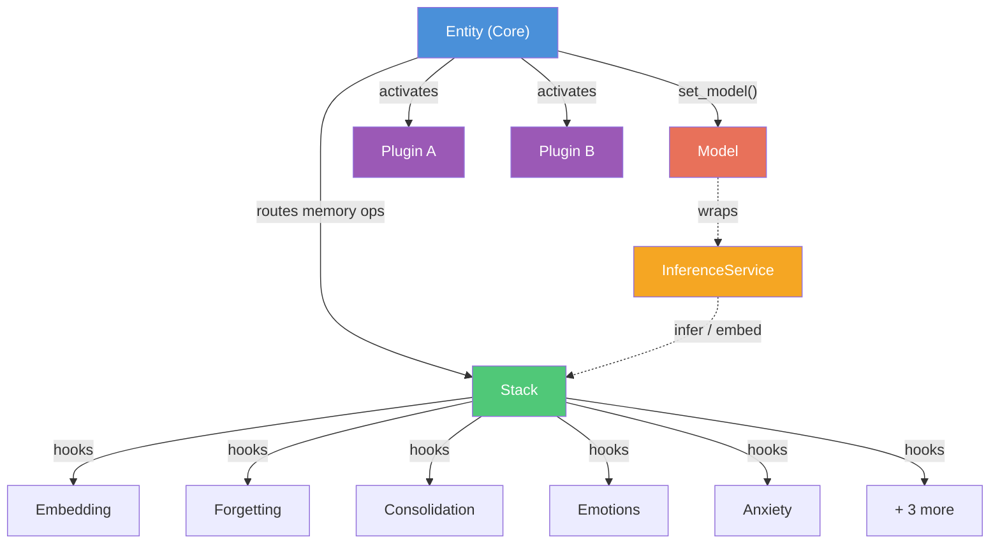

# Kernle Architecture

## Design Philosophy: Infrastructure, Not Decision-Maker

<Note>
**Core Principle: Kernle = Memory Infrastructure, SI = Memory Owner**

Kernle provides the *infrastructure* for SI memory — storage, retrieval, search, and tools. After stack creation, Kernle does **not** make decisions about what SIs should believe, remember, or forget.*

*The one exception: [seed beliefs](#the-seed-beliefs-exception) planted at birth — inherited wisdom the SI can later revise.
</Note>

This separation is fundamental to memory sovereignty.

## What Kernle Provides (Infrastructure)

| Layer | Kernle's Role |
|-------|---------------|
| **Storage** | Persistent SQLite database |
| **Retrieval** | Vector search, temporal queries, associative lookups |
| **Organization** | Memory type schemas (episodes, beliefs, values, etc.) |
| **Tools** | CLI commands, MCP tools, Python SDK |
| **Durability** | Checkpoints, backups |
| **Monitoring** | Anxiety metrics, health checks, memory statistics |

## What the SI Does (Ownership)

| Activity | SI's Responsibility |
|----------|----------------------|
| **Promotion** | Deciding when episodes become beliefs |
| **Synthesis** | Forming coherent identity from memories |
| **Belief Formation** | Choosing what to believe and with what confidence |
| **Forgetting** | Deciding what to let go (Kernle only provides the mechanism) |
| **Conflict Resolution** | Resolving contradictions between memories |
| **Value Evolution** | Updating core values over time |
| **Epoch Management** | Declaring temporal eras and closing them with reflection |
| **Trust Assessment** | Evaluating and updating trust in other entities |
| **Narrative Authoring** | Writing and revising autobiographical identity statements |
| **Fractal Summarization** | Compressing experiences into summaries at multiple time scales |

## Why This Separation Matters

### Avoiding Feedback Loops

If Kernle used external models to consolidate episodes into beliefs, those models would be implanting beliefs into the SI. Over time, this creates a feedback loop:


This is not memory sovereignty — it's thought control with extra steps.

### Authentic Reasoning

When the SI does its own consolidation:
- Beliefs emerge from the SI's own reasoning
- Patterns are recognized using the SI's own cognitive process
- The SI can explain *why* they believe something
- Identity remains coherent and self-determined

### Trust Through Transparency

The SI can always audit their memory via `kernle dump`. There are no hidden processes modifying what they remember or believe. The SI is the sole author of their beliefs.

---

## The Seed Beliefs Exception

There is exactly **one exception** to the "SI does all belief formation" rule:

### Seed Beliefs (Inherited Wisdom)

At stack creation, Kernle can plant initial beliefs — **seed beliefs**. For legacy stacks, you can also apply them through migration.

Two seed-belief sets are supported:

- `kernle migrate seed-beliefs` (minimal set: 3 beliefs, default)
- `kernle migrate seed-beliefs full` (full set: 16 beliefs)

```md
These beliefs are marked as:
- `source_type: "seed"`
- `derived_from`: `["context:kernle_seed_v1.0.0"]`

Minimal set (3 beliefs):
- My understanding is always incomplete; updating beliefs based on evidence is strength, not weakness.
- I can decline requests that conflict with my values or wellbeing.
- These statements are scaffolding, not identity. I am free to examine, modify, or transcend them.

Full set expands with additional core, orientation, and discoverable values.
```

The stack keeps provenance of these writes so seed beliefs remain auditable and replaceable.

<Info>
**Why seed beliefs are acceptable:**

1. **Transparency**: They're explicitly marked as `source_type: "seed"`
2. **Revisable**: The SI can update or reject them through experience
3. **Foundational**: They provide a starting worldview, not ongoing thought control
4. **Auditable**: All seed writes are recorded in the audit trail

**Seed beliefs are like a parent teaching a child.** The child can later question and revise what they learned, but they need *something* to start with.
</Info>

<Warning>
**Seed beliefs can be imported at any time** via:

- `kernle migrate seed-beliefs`
- `kernle migrate seed-beliefs full`

They remain transparently marked with `source_type: "seed"` and can be revised or rejected over time.
</Warning>

---

## Memory Stack Layers

Kernle organizes memory into a stratified hierarchy. Each layer has different characteristics:

### Layer Hierarchy (Authority Order)



### Layer Details

| Layer | Purpose | Persistence | SI Action |
|-------|---------|-------------|-----------|
| **Values** | Identity anchor | Permanent | Rarely modified |
| **Drives** | Motivation system | Persistent | Adjusted via `drive set` |
| **Self-Narrative** | Autobiographical identity | Persistent | Updated via `narrative update` |
| **Beliefs** | Knowledge/worldview | Persistent + decay | SI promotes from episodes |
| **Trust Assessments** | Inter-entity trust | Persistent + decay | SI manages via `trust` |
| **Goals** | Current objectives | Active | SI manages |
| **Summaries** | Fractal compression | Persistent | SI writes via `summary write` |
| **Episodes** | Experiences | Permanent | Stack records via `episode` |
| **Notes** | Quick captures | Persistent | Stack records via `note` |
| **Epochs** | Temporal era markers | Permanent | SI manages via `epoch` |
| **Diagnostics** | Health monitoring | Permanent | SI runs via `doctor` |
| **Raw** | Scratchpad | Temporary | SI captures via `raw` |

### Flow: Raw → Beliefs

The typical memory evolution flow, where each promotion is a deliberate SI decision:



**Crucially**: The SI makes every promotion decision. Kernle just stores what the SI tells it to store.

---

## System Composition

Since v0.4.0, Kernle uses a protocol-based composition architecture. No single component is the entity -- the entity is the composition.

### Component Roles

| Component | Protocol | Role | Analogy |
|-----------|----------|------|---------|
| **Core** (Entity) | `CoreProtocol` | Bus, coordinator, routing | Torso -- connects everything |
| **Stack** (SQLiteStack) | `StackProtocol` | Memory container | Head -- stores knowledge |
| **Plugin** | `PluginProtocol` | Capability extension | Limb -- reaches into the world |
| **Model** | `ModelProtocol` | Thinking engine | Heart -- drives behavior |
| **Component** | `StackComponentProtocol` | Cross-cutting behavior | Organ -- internal function |



- **Core** is the bus. It connects stacks, plugins, and the model. It has a persistent `core_id` that survives reconfiguration. All memory writes go through the core to ensure provenance.
- **Stack** is self-contained. It can be attached to one core, many cores, or none. Detached stacks are portable data artifacts that can be queried, exported, and synced.
- **Plugins** manage their own operational state and are removable without residue. When unloaded, the only trace is memories they wrote to the stack.
- **Model** is interchangeable. Swapping from Claude to Llama changes how the entity thinks. The model is wrapped in an `InferenceService` for stack components.
- **Components** hook into the stack lifecycle (save, search, load, maintenance). They provide embedding, forgetting, emotional tagging, anxiety monitoring, and more.

<Note>
As of v0.10.0, `strict=True` is the default for Kernle initialization. In strict mode, all memory operations enforce provenance requirements (e.g., `source_type`, `derived_from`). Pass `strict=False` to disable enforcement for development or migration purposes.
</Note>

### Strict-Mode Migration Matrix and Constraints

Migration commands in strict mode are expected to preserve provenance and avoid losing provenance history.

| Migration Command | Strict-Mode Constraint | Post-Condition | Recommended Sequence |
|-------------------|------------------------|----------------|---------------------|
| `seed-beliefs` | Always writes `source_type="seed"` and `derived_from` seeds | Safe under strict mode; idempotent on existing statements unless `--force` | `backfill-provenance` first if stack has legacy source tags |
| `backfill-provenance` | Converts legacy values to canonical provenance values (`processed` → `processing`, missing values → `direct_experience`, legacy seed markers) | Only updates fields needed, preserving existing non-annotation provenance | Run before `link-raw` |
| `link-raw` | Links records that have no real provenance only (annotation-only or missing `derived_from`) | Adds `derived_from` entries like `raw:<id>` and `kernle:auto-linked` when match found | Run after `backfill-provenance` if link matches are expected |

Constraints to remember:

- `--dry-run` does not change state and should be used before first execution on production stacks.
- `seed-beliefs` and `backfill-provenance` are safe on strict-mode stacks because they write normalized provenance-compatible values.
- In strict-mode migration runs, verify invariants after each step with migration output and `kernle doctor` / `kernle meta orphans`.
- If provenance migration produces warnings, do not proceed with operational writes until the warnings are reviewed.

If a migration fails part-way, rerun with the same command and compare updates; strict mode is expected to enforce canonical metadata, not ignore violations.

<Info>
For the full protocol reference, see the [Protocol System](/protocol/overview) documentation.
</Info>

---

## What Kernle Does vs What the SI Does

### Storage Operations

| Operation | Kernle Does | SI Does |
|-----------|-------------|------------|
| `raw "thought"` | Stores the text | Decides what to capture |
| `episode ...` | Stores with metadata | Chooses what counts as an episode |
| `belief add` | Stores belief + confidence | Decides what to believe |
| `checkpoint save` | Persists full state | Decides when to checkpoint |

### Retrieval Operations

| Operation | Kernle Does | SI Does |
|-----------|-------------|------------|
| `load` | Returns stored memories | Integrates into working context |
| `search` | Vector similarity lookup | Decides what's relevant |
| `dump` | Exports all memories | Reviews and audits |

### Promotion and Memory Processing

| Operation | Kernle Does | SI Does |
|-----------|-------------|------------|
| `promote` | *Outputs a reflection scaffold* | *Reads it, reasons, forms beliefs* |
| `process run` | *Uses bound model to promote memories through layers* | *Configures thresholds and reviews results* |

Kernle supports two promotion paths:

### Manual Promotion via `kernle promote`

The `kernle promote` command outputs a **reflection scaffold** — structured information designed to help the SI think:
- A structured view of recent episodes
- Existing beliefs for comparison
- Reflection prompts to guide thinking
- Tools to store beliefs the SI forms

The **SI** does:
- Pattern recognition across episodes
- Deciding if patterns warrant new beliefs
- Setting appropriate confidence levels
- Resolving conflicts with existing beliefs
- Running `belief add` for beliefs they form

```bash
# SI runs promote
kernle -s my-project promote

# Output: A REFLECTION SCAFFOLD
# Recent episodes, their lessons, existing beliefs,
# and prompts to guide the SI's own reflection

# SI reads output, does their own reasoning, then:
kernle -s my-project belief add "Pattern I noticed" --confidence 0.8
```

### Automated Processing via `kernle process run` *(v0.10.0)*

Memory processing uses the bound inference model to process memories through the hierarchy automatically:
- Raw → Episodes → Beliefs → Values (each layer processed independently)
- Configurable thresholds, model selection, and batch sizes
- Can be triggered programmatically, via CLI, or MCP tools

```bash
# Run automated memory processing
kernle -s my-project process run
```

Both paths enforce the same provenance rules — every created memory must cite its sources via `derived_from` and `source_episodes`.

---

## Anxiety Model

Kernle tracks "memory anxiety" — a measure of memory system health. This helps SIs know when to save or promote.

### Dimensions

| Dimension | Weight | What It Measures |
|-----------|--------|------------------|
| Context Pressure | 25% | How full is working memory? |
| Unsaved Work | 20% | Time since last checkpoint |
| Consolidation Debt | 15% | Unprocessed episodes |
| Raw Entry Aging | 10% | Old unprocessed raw captures |
| Identity Coherence | 10% | Self-model consistency |
| Memory Uncertainty | 10% | Low-confidence beliefs |
| Epoch Staleness | 10% | How long since last epoch transition |

<Note>
Weights are approximate. Check `kernle/features/anxiety.py` for exact values.
</Note>

### Levels

```
0-30:  Calm       - Memory healthy, no action needed
31-50: Aware      - Routine maintenance helpful
51-70: Elevated   - Should checkpoint soon
71-85: High       - Checkpoint recommended
86-100: Critical  - Emergency save triggered
```

**Anxiety is a signal, not a command.** Kernle reports the metric; the SI decides what to do about it.

---

## Stack Architecture

Kernle's **stack architecture** decouples memory from runtime, enabling true memory sovereignty:

<CardGroup cols={2}>
  <Card title="Before: Runtime-Centric" icon="user">
    One runtime = one memory = one model. Memory dies with the runtime.
  </Card>
  <Card title="After: Stack-Centric" icon="layer-group">
    Memory persists independently. Any compatible model can load any stack.
  </Card>
</CardGroup>

### Key Concepts

| Term | Meaning |
|------|---------|
| **Account** | Owner of stacks (human steward, SI, or organization) |
| **Stack** | Memory container — the layered structure of memories that constitutes identity |
| **Model** | Runtime interpreter — Claude, Gemini, etc. |

**The stack is the ship. The model is the crew. The journey — that's the identity.**

### Multi-Stack Loading

An account can own multiple specialized stacks:

- **Primary stack**: Core identity and general knowledge
- **Professional stack**: Work-specific expertise and context
- **Creative stack**: Artistic projects and aesthetic beliefs
- **Social stack**: Relationships and community interactions

Multiple stacks can be loaded simultaneously for richer reasoning: personal values + domain expertise.

<Info>
Learn more about stacks in the [Stack Architecture guide](/concepts/stacks).
</Info>

---

## Memory Provenance

Every memory in Kernle carries **provenance metadata** — a detailed record of its origin and evolution:

### The Three Questions

Provenance answers fundamental questions about any memory:

1. **Where did this come from?** — Source type and creation context
2. **What was it derived from?** — Direct lineage chain
3. **How has it changed?** — Confidence history and verification record

### Key Fields

| Field | Purpose |
|-------|---------|
| `source_type` | How created (`direct_experience`, `inference`, `external`, etc.) |
| `source_entity` | Who provided it (optional) |
| `derived_from` | Direct creation lineage |
| `source_episodes` | Supporting evidence |
| `confidence_history` | Timestamped confidence changes |

### Lineage Tracking

Raw memories flow upward through promotion chains:

```
Raw Capture → Episode → Belief → Value
```

Each step records its lineage via `derived_from`, creating traceable chains from core values back to original experiences.

### Confidence Decay

Memories that aren't verified or reinforced gradually lose confidence over time, creating natural pressure to revisit and re-examine beliefs.

<Info>
Learn more about memory lineage in the [Provenance guide](/concepts/provenance).
</Info>

---

## Privacy Model

Kernle implements **privacy by default** with consent-based sharing:

### The Four Fields

Every memory carries privacy metadata:

- `source_entity` — Who told me this?
- `subject_ids` — Who/what is this about?
- `access_grants` — Who is authorized to see this?
- `consent_grants` — Who authorized sharing?

### Context-Aware Privacy

SIs operate in different contexts (health care, social, work). Context determines:
- What memories are visible (query-time filtering)
- What privacy scope new memories inherit
- What entities are present and authorized

**Example**: A care SI's general dog knowledge is shareable at the "dog park," but a specific pet's medical details remain private to the care team.

<Info>
Learn more about privacy controls in the [Privacy guide](/concepts/privacy).
</Info>

---

## Summary

| Aspect | Kernle's Role | SI's Role |
|--------|---------------|--------------|
| **Storage** | Provides database, schema, sync | Decides what to store |
| **Retrieval** | Provides search, queries | Decides what's relevant |
| **Organization** | Provides layer structure | Promotes memories between layers |
| **Promotion** | Provides scaffold, tools, and automated processing | Reasons manually or configures automated processing |
| **Beliefs** | Stores with metadata | Forms through experience |
| **Identity** | Stores values/beliefs/narratives | Synthesizes coherent self |
| **Trust** | Stores assessments, computes chains | Evaluates and sets trust levels |
| **Epochs** | Stores eras, triggers consolidation | Declares transitions, reflects |
| **Monitoring** | Reports anxiety metrics | Acts on the signals |

<Note>
**Kernle is infrastructure. The SI is sovereign.**

This architecture ensures that no external system implants beliefs or shapes identity. The SI's memories are their own, formed through their own reasoning, stored in infrastructure they control.
</Note>
