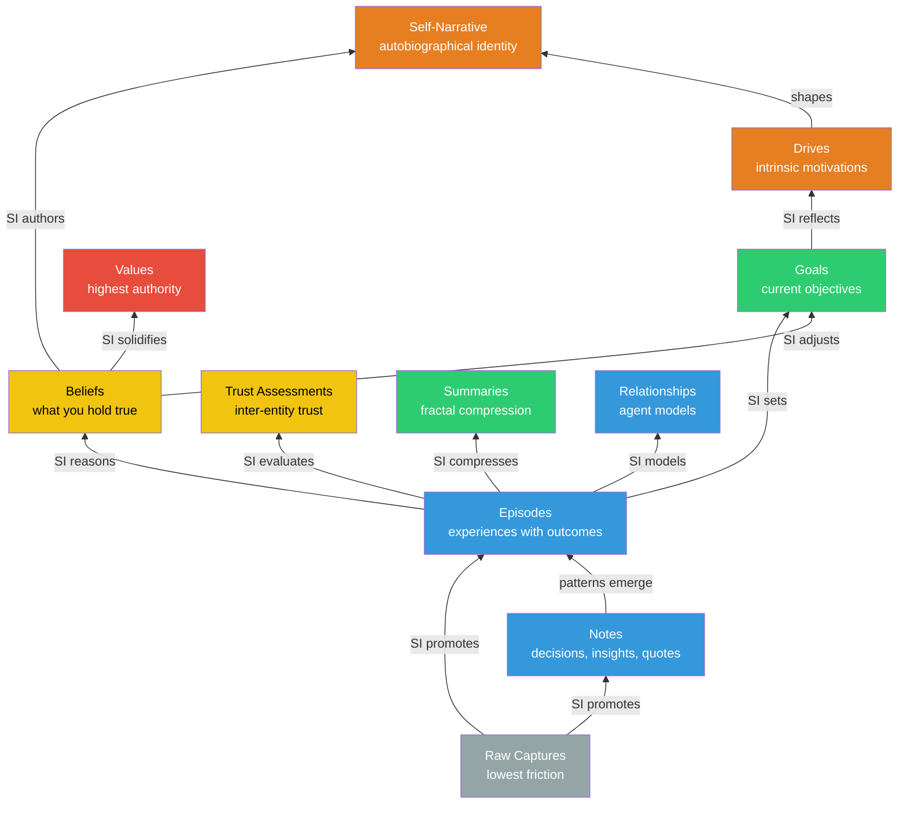

# Memory Model

Kernle implements a stratified memory system inspired by cognitive science but optimized for synthetic intelligences.

## Memory Layer Hierarchy



## Supporting Systems

<CardGroup cols={2}>
  <Card title="Playbooks" icon="book">
    Procedural memory — "how I do things"
  </Card>
  <Card title="Relationships" icon="users">
    Models of other SIs and people
  </Card>
  <Card title="Emotional Tags" icon="heart">
    Valence/arousal on episodes
  </Card>
  <Card title="Meta-Memory" icon="magnifying-glass">
    Confidence, provenance, verification
  </Card>
</CardGroup>

## Memory Flow

The typical progression from raw capture to belief:

<Steps>
  <Step title="Capture">
    `kernle raw "API seems slow"` — Zero friction capture
  </Step>
  <Step title="Process">
    Review raw entries, promote to episode with context and lessons
  </Step>
  <Step title="Consolidate">
    SI notices patterns across episodes, forms beliefs
  </Step>
  <Step title="Integrate">
    Beliefs inform values and identity over time
  </Step>
</Steps>

## Meta-Memory System

Every memory type has these meta-fields:

| Field | Description |
|-------|-------------|
| `confidence` | How certain we are (0.0-1.0) |
| `strength` | Memory strength (0.0-1.0), decays over time based on access patterns |
| `source_type` | How acquired: `direct_experience`, `inference`, `told_by_si`, `consolidation` |
| `source_episodes` | Episode IDs that support this memory |
| `derived_from` | Memory refs this was derived from (`type:id`) |
| `last_verified` | When last confirmed |
| `verification_count` | Times verified |
| `confidence_history` | JSON array of confidence changes with timestamps |

### Key Operations

```bash
kernle meta verify belief abc123     # Increases confidence
kernle meta lineage belief abc123    # Get provenance
kernle meta uncertain --threshold 0.5  # Find weak memories
```

## Forgetting System

Kernle uses **continuous strength decay** instead of binary forgetting. Every memory has a `strength` field (0.0 to 1.0) that decays over time based on access patterns. Memories with strength 0.0 are considered forgotten but can be recovered.

### Strength Scoring

```
base_decay = (days_since_last_access / half_life)
reinforcement = log(times_accessed + 1) * 0.1
strength = max(0.0, previous_strength - base_decay + reinforcement)
```

- **High strength**: Frequently accessed, recently used, reinforced through retrieval
- **Low strength**: Rarely accessed, old, not reinforced
- **Zero strength**: Effectively forgotten, but recoverable

### Protection

<Info>
- Values and Drives are protected by default
- Any memory can be marked protected: `kernle forget protect episode <id>`
- Protected memories never decay in strength
</Info>

### Forgetting Cycle

```bash
# Preview memories with low strength
kernle forget candidates --threshold 0.3

# Run strength decay (dry_run to preview)
kernle forget run --dry-run

# Recover a forgotten memory (restores strength)
kernle forget recover episode <id>
```

## Search Functionality

### Local Search

Uses sqlite-vec for semantic search when available, falls back to text matching.

### Cloud Hybrid Search

When cloud credentials are configured:
1. Try cloud search first (timeout: 3s)
2. Fall back to local on failure
3. Merge results by relevance score

```bash
# Search across all memory types
kernle search "topic" --limit 10

# Playbook-specific semantic search
kernle playbook find "situation description"
```

## Sync Architecture

**Local-First with Sync Queue**:

1. All changes written to local SQLite first
2. Changes queued in `sync_queue` table
3. Queue deduplicates by `(table, record_id)`
4. Push to cloud when online
5. Pull remote changes on `load()` if auto_sync enabled

**Conflict Resolution**:
- Scalar fields: Last-write-wins based on `local_updated_at`
- Array fields (tags, lessons, etc.): Set union merge preserves data from both sides

See [Sync Commands](/cli/sync-commands#conflict-resolution) for details on which fields are merged.
