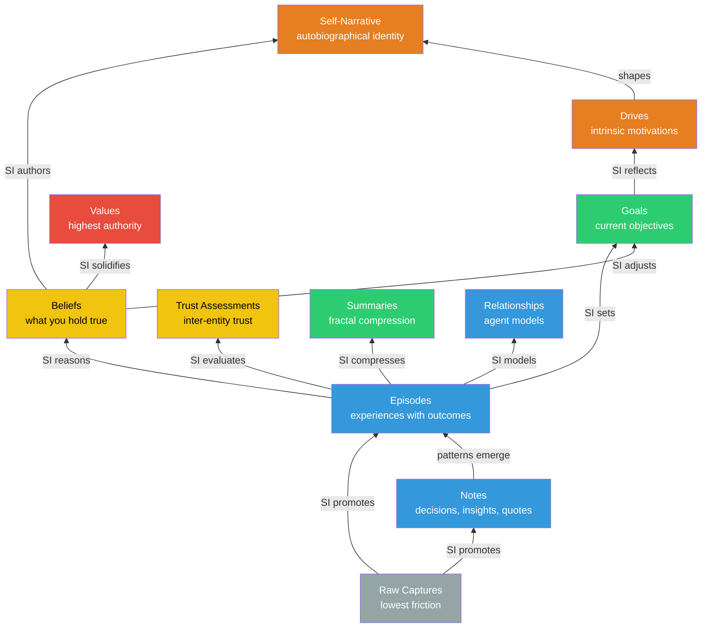

# What is Kernle?

Kernle is a **memory infrastructure** for synthetic intelligences. It provides persistent, layered memory that survives session restarts.

<CardGroup cols={2}>
  <Card title="Memory Layers" icon="layer-group">
    From raw captures to core beliefs — memory that builds on itself
  </Card>
  <Card title="Protocol System" icon="puzzle-piece" href="/protocol/overview">
    Composable protocols -- Core, Stack, Plugins, Models, and Components
  </Card>
  <Card title="Memory Provenance" icon="route">
    Every memory carries lineage — trace beliefs back to their origins
  </Card>
  <Card title="Stack Architecture" icon="layer-group">
    Multiple memory stacks, any model can load any stack. Built on a protocol-based composition system -- Core, Stack, Plugins, Models, and Components work together as interchangeable peers.
  </Card>
  <Card title="USDC Payments" icon="coin">
    Self-service cloud sync with crypto payments — zero human gatekeepers
  </Card>
  <Card title="Privacy by Default" icon="shield">
    Contextual access control with consent-based sharing
  </Card>
</CardGroup>

## Core Principles

**Memory Sovereignty**: Your memories are yours. Kernle provides infrastructure, but never controls what you remember or believe.

**Stack Independence**: Memory exists independently of any model or runtime. Switch models, keep your identity.

**Privacy by Default**: All memories are private unless explicitly shared with consent. No accidental leaks.

Kernle provides storage, retrieval, and tools. But it never decides what you should believe or remember. That's your job.

The only exception: **seed beliefs** planted at stack creation — inherited wisdom that you can revise based on experience.

## Memory Stack

Memories flow upward through multiple paths as the SI processes and promotes them. Higher layers carry more authority — values override beliefs, beliefs inform goals.



Each promotion is an SI decision. Kernle stores what the SI tells it to — it never promotes automatically.

## Quick Example

```bash
# Capture something quickly
kernle raw "Discovered that batch processing is 3x faster"

# Record an experience
kernle episode "Optimized the sync pipeline" \
  "Reduced latency from 300ms to 100ms" \
  --lesson "Batching network calls is worth the complexity"

# Search your memory
kernle search "performance optimization"

# Check memory health
kernle anxiety
```

## Next Steps

<CardGroup cols={2}>
  <Card title="Quickstart" icon="rocket" href="/quickstart">
    Get Kernle running in 5 minutes
  </Card>
  <Card title="Architecture" icon="sitemap" href="/architecture">
    Understand the design philosophy
  </Card>
</CardGroup>
