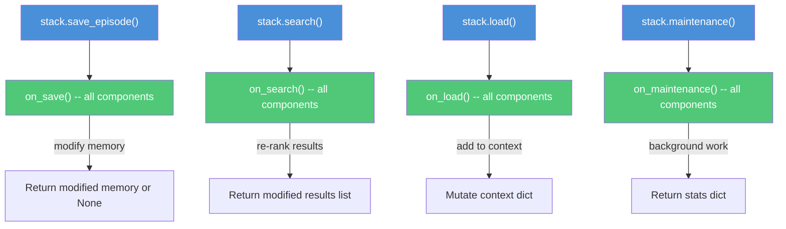

# StackComponentProtocol -- Cross-Cutting Concerns

Stack components are the stack's equivalent of plugins. They extend what the stack can do by hooking into its lifecycle: memory saves, searches, loads, and periodic maintenance.

Think of them as middleware for memory operations. When a memory is saved, every component gets notified. When search results come back, every component can re-rank them. When maintenance runs, every component does its background work.

## StackComponentProtocol Interface

```python
@runtime_checkable
class StackComponentProtocol(Protocol):

    @property
    def name(self) -> str:
        """Component identifier (e.g., 'embedding', 'forgetting')."""
        ...

    @property
    def version(self) -> str:
        """Semantic version."""
        ...

    @property
    def required(self) -> bool:
        """Whether the stack needs this to function.
        True: stack refuses to operate without it.
        False: stack works without it, with reduced capability."""
        ...

    @property
    def needs_inference(self) -> bool:
        """Whether this component needs model inference.
        If True and no InferenceService is available, the component
        degrades gracefully (skips inference-dependent operations)."""
        ...

    def attach(self, stack_id: str, inference: Optional[InferenceService] = None) -> None:
        """Called when the component is added to a stack."""
        ...

    def detach(self) -> None:
        """Called when the component is removed from a stack."""
        ...

    def set_inference(self, inference: Optional[InferenceService]) -> None:
        """Update the inference service when the model changes."""
        ...

    # Lifecycle hooks
    def on_save(self, memory_type: str, memory_id: str, memory: Any) -> Any: ...
    def on_search(self, query: str, results: list[SearchResult]) -> list[SearchResult]: ...
    def on_load(self, context: dict[str, Any]) -> None: ...
    def on_maintenance(self) -> dict[str, Any]: ...
```

### Properties

| Property | Type | Purpose |
|----------|------|---------|
| `name` | `str` | Unique identifier for registry lookup |
| `version` | `str` | Semantic version string |
| `required` | `bool` | If `True`, stack refuses to operate without it |
| `needs_inference` | `bool` | If `True`, uses `InferenceService` when available |

## Hook Dispatch

The stack calls component hooks at four points in its lifecycle:



### on_save

Called after a memory is saved. Can modify the memory by returning a modified version (return `None` to leave unchanged).

**Used by:**
- **EmotionalTagging**: Detects valence/arousal, adds emotional metadata
- **MetaMemory**: Initializes confidence tracking
- **Embedding**: Generates and stores vector representation

### on_search

Called after search results are assembled. Returns the (possibly modified) results list. Components can re-rank, filter, or augment results.

**Used by:**
- **Forgetting**: Could filter out low-salience results
- **EmotionalTagging**: Could boost emotionally relevant results

### on_load

Called during `load()` working memory assembly. Components contribute to the context dict by mutating it directly.

**Used by:**
- **Anxiety**: Adds current anxiety levels and dimension scores
- **Forgetting**: Adds forgetting statistics

### on_maintenance

Called during periodic maintenance. Each component does background work and returns a stats dict. The stack combines all stats keyed by component name.

**Used by:**
- **Forgetting**: Runs salience decay sweeps, soft-deletes low-salience memories
- **Consolidation**: Detects cross-domain patterns in episodes
- **Suggestions**: Scans raw entries for potential episodes/beliefs/notes
- **MetaMemory**: Applies confidence decay to stale memories
- **Knowledge**: Analyzes domain coverage and knowledge gaps

## Error Isolation

Component failures never crash stack operations. If a component's hook throws an exception, the stack logs the error and continues with the remaining components. This isolation means:

- A buggy emotional tagger won't prevent memory saves
- A failing embedding component won't break search (results just won't have embeddings)
- One component crashing during maintenance won't prevent others from running

## The 8 Default Components

SQLiteStack auto-loads all 8 built-in components on initialization. Pass `components=[]` for a bare stack, or an explicit list for custom configuration.

| Component | Name | Required | Needs Inference | Purpose |
|-----------|------|----------|-----------------|---------|
| **EmbeddingComponent** | `embedding-ngram` | Yes | No | Vector embeddings for semantic search. Uses local hash embedder by default, delegates to `InferenceService.embed()` when available. |
| **ForgettingComponent** | `forgetting` | No | No | Salience-based memory decay. Calculates salience from confidence, access count, and age. Soft-deletes low-salience memories during maintenance. Protected memories are never forgotten. |
| **ConsolidationComponent** | `consolidation` | No | Yes | Cross-domain pattern detection across episodes. Identifies common lessons, finds structural similarities across domains. With inference, can synthesize episodes into beliefs. |
| **EmotionalTaggingComponent** | `emotions` | No | Yes | Automatic emotion detection from text. Tags memories with valence/arousal scores using keyword patterns. With inference, can do richer emotional analysis. |
| **AnxietyComponent** | `anxiety` | No | No | Memory health monitoring. Measures anxiety across dimensions: consolidation debt, raw aging, identity coherence, memory uncertainty, epoch staleness. Contributes anxiety levels to working memory. |
| **SuggestionComponent** | `suggestions` | No | Yes | Pattern-based extraction from raw entries. Scans raw captures and detects potential episodes, beliefs, and notes using regex patterns. Generates `MemorySuggestion` records for review. |
| **MetaMemoryComponent** | `metamemory` | No | No | Confidence tracking and time-based decay. Monitors confidence over time, applies decay to unverified memories, surfaces uncertain memories for review. |
| **KnowledgeComponent** | `knowledge` | No | Yes | Knowledge domain mapping. Analyzes beliefs, episodes, and notes to map competence boundaries and detect knowledge gaps. With inference, generates richer domain analysis. |

### Component Configuration

```python
from kernle.stack import SQLiteStack
from kernle.stack.components import (
    EmbeddingComponent,
    ForgettingComponent,
    get_default_components,
    get_minimal_components,
)

# All 8 defaults (standard)
stack = SQLiteStack(db_path="memory.db")

# Bare stack -- no components
stack = SQLiteStack(db_path="memory.db", components=[])

# Minimal -- just embedding
stack = SQLiteStack(
    db_path="memory.db",
    components=get_minimal_components(),
)

# Custom selection
stack = SQLiteStack(
    db_path="memory.db",
    components=[EmbeddingComponent(), ForgettingComponent()],
)
```

## Entry Point Registration

Stack components register in the `kernle.stack_components` entry point group:

```toml
# pyproject.toml
[project.entry-points."kernle.stack_components"]
embedding = "kernle.stack.components.embedding:EmbeddingComponent"
forgetting = "kernle.stack.components.forgetting:ForgettingComponent"
consolidation = "kernle.stack.components.consolidation:ConsolidationComponent"
emotions = "kernle.stack.components.emotions:EmotionalTaggingComponent"
anxiety = "kernle.stack.components.anxiety:AnxietyComponent"
suggestions = "kernle.stack.components.suggestions:SuggestionComponent"
metamemory = "kernle.stack.components.metamemory:MetaMemoryComponent"
knowledge = "kernle.stack.components.knowledge:KnowledgeComponent"
```

Components can also be discovered dynamically:

```python
from kernle.stack.components import load_components_from_discovery

# Discover and instantiate all installed components
components = load_components_from_discovery()
```

## Building a Custom Component

To create a custom stack component, implement the `StackComponentProtocol`:

```python
from kernle.protocols import InferenceService, SearchResult

class TimestampComponent:
    """Adds access timestamps to search results."""

    name = "timestamps"
    version = "1.0.0"
    required = False
    needs_inference = False

    def __init__(self):
        self._stack_id = None
        self._inference = None

    def attach(self, stack_id, inference=None):
        self._stack_id = stack_id
        self._inference = inference

    def detach(self):
        self._stack_id = None
        self._inference = None

    def set_inference(self, inference):
        self._inference = inference

    def on_save(self, memory_type, memory_id, memory):
        return None  # no modification

    def on_search(self, query, results):
        # Add retrieval timestamp to metadata
        from datetime import datetime, timezone
        now = datetime.now(timezone.utc).isoformat()
        for result in results:
            result.metadata["retrieved_at"] = now
        return results

    def on_load(self, context):
        pass  # no contribution to working memory

    def on_maintenance(self):
        return {"status": "ok"}
```

Register it:

```toml
[project.entry-points."kernle.stack_components"]
timestamps = "my_package:TimestampComponent"
```

Add it to a stack at runtime:

```python
stack.add_component(TimestampComponent())
```

Or include it in the initial component list:

```python
from kernle.stack.components import get_default_components

components = get_default_components() + [TimestampComponent()]
stack = SQLiteStack(db_path="memory.db", components=components)
```
