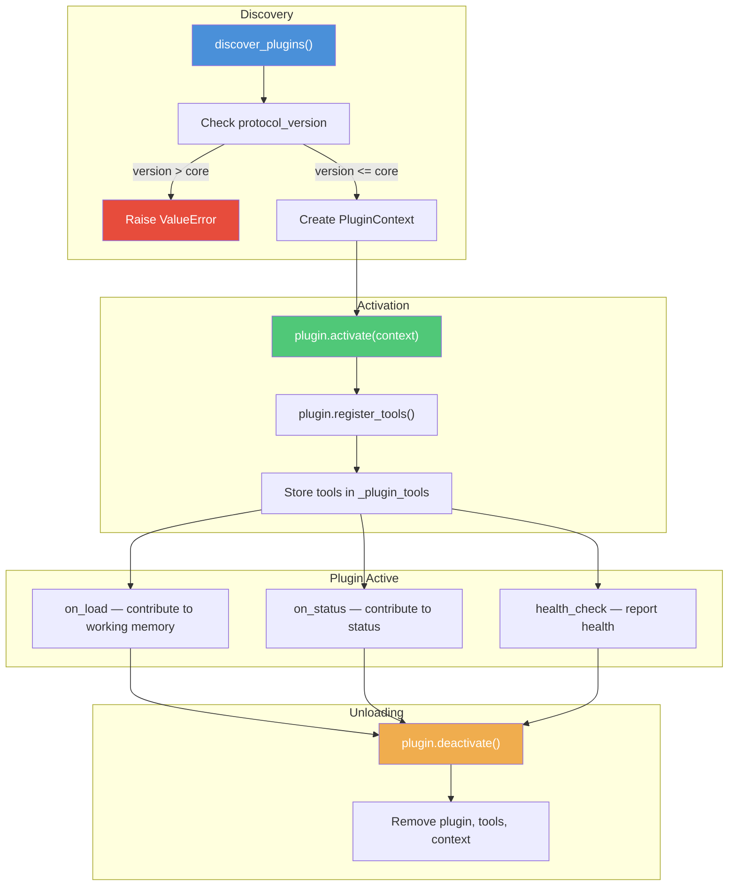
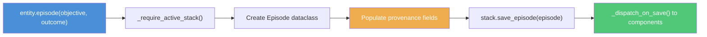

# CoreProtocol — The Coordinator

The core is the bus. It connects stacks, plugins, and the model. It has an ID. It routes operations. It manages the composition.

The core is not "the entity." The entity is the composition. But the core is what holds the composition together.

<Note>
The `core_id` persists across reconfigurations. Swap the model, change the stacks, add or remove plugins -- the `core_id` stays the same.
</Note>

## CoreProtocol Interface

The default implementation is `kernle.entity.Entity`.

### Properties

| Property | Type | Description |
|----------|------|-------------|
| `core_id` | `str` | Persistent identifier for this core |
| `model` | `Optional[ModelProtocol]` | Currently bound model (`None` if not configured) |
| `active_stack` | `Optional[StackProtocol]` | Currently active stack (`None` if none attached) |
| `stacks` | `dict[str, StackInfo]` | All attached stacks, keyed by alias |
| `plugins` | `dict[str, PluginInfo]` | All loaded plugins, keyed by name |

### Model Management

| Method | Signature | Description |
|--------|-----------|-------------|
| `set_model` | `(model: ModelProtocol) -> None` | Bind a model. Replaces any previous model. Notifies all stacks via `on_model_changed`. |

### Stack Management

| Method | Signature | Description |
|--------|-----------|-------------|
| `attach_stack` | `(stack, *, alias=None, set_active=True) -> str` | Attach a stack. Returns the assigned alias. |
| `detach_stack` | `(alias: str) -> None` | Detach a stack. The stack continues to exist independently. |
| `set_active_stack` | `(alias: str) -> None` | Switch which attached stack receives routed operations. |

### Plugin Management

| Method | Signature | Description |
|--------|-----------|-------------|
| `load_plugin` | `(plugin: PluginProtocol) -> None` | Activate a plugin. Creates PluginContext, registers tools. |
| `unload_plugin` | `(name: str) -> None` | Deactivate and remove a plugin. |
| `discover_plugins` | `() -> list[PluginInfo]` | Scan entry points for available plugins. |

### Routed Memory Operations

| Method | Key Parameters |
|--------|---------------|
| `episode()` | `objective, outcome, *, lessons, tags, source, context` |
| `belief()` | `statement, *, type, confidence, foundational, source` |
| `value()` | `name, statement, *, priority, type, foundational` |
| `goal()` | `title, *, description, goal_type, priority` |
| `note()` | `content, *, type, speaker, tags, protect, source` |
| `drive()` | `drive_type, *, intensity, focus_areas, decay_hours` |
| `relationship()` | `other_stack_id, *, trust_level, notes, entity_type` |
| `raw()` | `blob, *, source` |

### Routed Search, Load, and Status

| Method | Signature | Description |
|--------|-----------|-------------|
| `search` | `(query, *, limit=10, record_types=None, context=None) -> list[SearchResult]` | Semantic search on active stack |
| `load` | `(*, token_budget=8000, context=None) -> dict[str, Any]` | Assemble working memory, then call `on_load()` on all plugins |
| `status` | `() -> dict[str, Any]` | Full system status including core, model, stacks, and plugins |

### Trust Operations

| Method | Signature |
|--------|-----------|
| `trust_set` | `(entity, domain, score, *, evidence=None) -> str` |
| `trust_get` | `(entity, *, domain=None) -> list[TrustAssessment]` |
| `trust_list` | `(*, domain=None, min_score=None) -> list[TrustAssessment]` |

### Binding Management

| Method | Signature | Description |
|--------|-----------|-------------|
| `get_binding` | `() -> Binding` | Snapshot the current composition |
| `save_binding` | `(path=None) -> Path` | Save the binding to disk |
| `from_binding` | `(binding: Binding \| Path) -> CoreProtocol` | Restore a core from a saved binding (classmethod) |

## Stack Management

The core manages multiple stacks with one active at a time. All routed operations go to the active stack.

```python
from kernle.entity import Entity
from kernle.stack import SQLiteStack

# Create the core
entity = Entity(core_id="my-entity")

# Attach stacks
entity.attach_stack(SQLiteStack("primary"), alias="primary")
entity.attach_stack(SQLiteStack("work"), alias="work", set_active=False)

# Switch context
entity.set_active_stack("work")

# Detach when done
entity.detach_stack("work")
```

When a stack is attached, the core calls `stack.on_attach(core_id, inference_service)` so the stack can pass the inference service to its components. When detached, `stack.on_detach(core_id)` clears inference access.

## Plugin Lifecycle

Plugins follow a strict lifecycle managed by the core.



## Protocol Version Enforcement

The core checks the plugin's `protocol_version` property on load:

```python
# From Entity.load_plugin()
plugin_pv = getattr(plugin, "protocol_version", None)
if plugin_pv is not None and plugin_pv > PROTOCOL_VERSION:
    raise ValueError(
        f"Plugin '{plugin.name}' requires protocol version {plugin_pv}, "
        f"but this core supports version {PROTOCOL_VERSION}."
    )
elif plugin_pv is not None and plugin_pv < PROTOCOL_VERSION:
    logger.warning(
        "Plugin '%s' uses protocol version %d (current: %d).",
        plugin.name, plugin_pv, PROTOCOL_VERSION,
    )
```

This ensures that a plugin built for a newer protocol cannot silently break on an older core. Older plugins are loaded with a warning since the core is expected to maintain backward compatibility.

## Operation Routing

When you call `entity.episode(...)`, the core does not just forward to the stack. It enforces provenance first.



The provenance step populates:

- **id**: New UUID
- **stack_id**: From the active stack
- **source_entity**: `"core:{core_id}"` or a custom source (plugins use `"plugin:{name}"`)
- **source_type**: `"direct_experience"`
- **created_at**: Current UTC timestamp
- **derived_from**: Optional lineage chain
- **context / context_tags**: Optional grouping

This is why writing through the core matters. Direct `stack.save_*()` calls skip provenance, producing memories with incomplete attribution.

```python
# The proper way -- full provenance
entity.episode(
    "Deploy to production",
    "Successful with zero downtime",
    lessons=["Blue-green deploys work well"],
    tags=["deployment"],
    context="work",
)

# Bypass -- incomplete provenance (for migration/repair only)
stack.save_episode(Episode(
    id="...",
    stack_id=stack.stack_id,
    objective="Deploy to production",
    outcome="Successful",
    # No source_entity, no context, no source_type
))
```

## Binding Save and Restore

A **Binding** is a serializable snapshot of the current composition: which core, which model, which stacks, which plugins.

```python
# Save current composition
entity.save_binding()
# Saves to ~/.kernle/bindings/{core_id}.json

# Restore later
restored = Entity.from_binding(Path("~/.kernle/bindings/my-entity.json"))
# restored._restored_binding contains the binding data
# Stacks and plugins need to be reattached/loaded from the binding info
```

The binding captures:
- `core_id` -- the persistent identity
- `model_config` -- which model was bound (provider, model_id)
- `stacks` -- alias-to-stack_id mapping
- `active_stack_alias` -- which stack was active
- `plugins` -- list of loaded plugin names
- `created_at` -- when the binding was taken

This enables reproducible compositions: save a binding, share it, and another instance can recreate the same setup.
