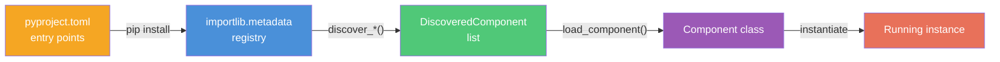

# Discovery & Entry Points

Kernle uses Python's `importlib.metadata` entry points to discover installed components at runtime. This means plugins, stacks, models, and stack components can be installed as separate packages and automatically found by the core.

## How It Works



1. A package declares entry points in its `pyproject.toml`
2. When the package is installed, Python's metadata registry records the entry points
3. Kernle's `discover_*()` functions scan the registry for matching groups
4. `load_component()` imports the class and returns it for instantiation

## The Four Entry Point Groups

| Group | Discovers | Used By |
|-------|-----------|---------|
| `kernle.plugins` | Plugin implementations (`PluginProtocol`) | `Entity.discover_plugins()` |
| `kernle.stacks` | Stack implementations (`StackProtocol`) | CLI stack selection |
| `kernle.models` | Model implementations (`ModelProtocol`) | Model binding |
| `kernle.stack_components` | Stack components (`StackComponentProtocol`) | `SQLiteStack` auto-loading |

### Registration Examples

Each entry point maps a name to a `module:class` reference:

<Tabs>
  <Tab title="Plugin">
    ```toml
    # In your plugin's pyproject.toml
    [project.entry-points."kernle.plugins"]
    chainbased = "chainbased.plugin:ChainbasedPlugin"
    ```
  </Tab>
  <Tab title="Stack">
    ```toml
    [project.entry-points."kernle.stacks"]
    sqlite = "kernle.stack.sqlite_stack:SQLiteStack"
    ```
  </Tab>
  <Tab title="Model">
    ```toml
    [project.entry-points."kernle.models"]
    anthropic = "kernle.models.anthropic:AnthropicModel"
    ollama = "kernle.models.ollama:OllamaModel"
    ```
  </Tab>
  <Tab title="Component">
    ```toml
    [project.entry-points."kernle.stack_components"]
    embedding = "kernle.stack.components.embedding:EmbeddingComponent"
    forgetting = "kernle.stack.components.forgetting:ForgettingComponent"
    ```
  </Tab>
</Tabs>

## Discovery Functions

The `kernle.discovery` module provides four targeted discovery functions plus a catch-all:

```python
from kernle.discovery import (
    discover_plugins,
    discover_stacks,
    discover_models,
    discover_stack_components,
    discover_all,
    load_component,
)

# Discover one group
plugins = discover_plugins()           # -> list[DiscoveredComponent]
stacks = discover_stacks()             # -> list[DiscoveredComponent]
models = discover_models()             # -> list[DiscoveredComponent]
components = discover_stack_components() # -> list[DiscoveredComponent]

# Discover everything
all_components = discover_all()  # -> dict[str, list[DiscoveredComponent]]

# Load a discovered component's class
for dc in discover_models():
    cls = load_component(dc)  # imports the class
    instance = cls()          # instantiate it
```

## DiscoveredComponent

Every discovery result is a `DiscoveredComponent` dataclass:

```python
@dataclass
class DiscoveredComponent:
    name: str                          # Entry point name (e.g., "anthropic")
    group: str                         # Entry point group (e.g., "kernle.models")
    module: str                        # Python module path
    attr: str                          # Class/factory name in that module
    dist_name: Optional[str] = None    # Package name (e.g., "kernle")
    dist_version: Optional[str] = None # Package version
    error: Optional[str] = None        # Error if discovery failed
    extras: dict[str, Any] = field(default_factory=dict)

    @property
    def qualname(self) -> str:
        """Full reference: 'module:attr'."""
        return f"{self.module}:{self.attr}"
```

| Field | Example |
|-------|---------|
| `name` | `"anthropic"` |
| `group` | `"kernle.models"` |
| `module` | `"kernle.models.anthropic"` |
| `attr` | `"AnthropicModel"` |
| `dist_name` | `"kernle"` |
| `dist_version` | `"0.8.0"` |
| `qualname` | `"kernle.models.anthropic:AnthropicModel"` |

## How Entity Uses Discovery

When `Entity.discover_plugins()` is called, it:

1. Calls `discover_plugins()` to scan the `kernle.plugins` entry point group
2. Returns a list of `PluginInfo` for each discovered plugin (name, version, description, capabilities)
3. The CLI `kernle status` command shows discovered plugins alongside loaded ones

Loading a discovered plugin is separate from discovering it:

```python
from kernle.discovery import discover_plugins, load_component

# Discover what's installed
discovered = discover_plugins()
for dc in discovered:
    print(f"Found plugin: {dc.name} from {dc.dist_name}")

# Load and activate one
plugin_cls = load_component(discovered[0])
plugin = plugin_cls()
entity.load_plugin(plugin)
```

## How SQLiteStack Uses Discovery

SQLiteStack can auto-load stack components from entry points:

```python
from kernle.stack.components import load_components_from_discovery

# Discover and instantiate all installed stack components
components = load_components_from_discovery()
```

By default, SQLiteStack uses the 8 built-in components (from `get_default_components()`). But `load_components_from_discovery()` will also pick up third-party components installed via separate packages.

If a component fails to load (import error, missing dependency), it logs a warning and skips that component -- other components still load normally.

## CLI Status Display

`kernle status` shows the current composition, including discovered components:

```bash
$ kernle -s mystack status

Core: a1b2c3d4-...
Model: claude-sonnet-4-5-20250929 (anthropic)
Active Stack: mystack (schema v5)

Components (8):
  embedding-ngram  v1.0.0  [required]
  forgetting       v1.0.0
  consolidation    v1.0.0  [needs inference]
  emotions         v1.0.0  [needs inference]
  anxiety          v1.0.0
  suggestions      v1.0.0  [needs inference]
  metamemory       v1.0.0
  knowledge        v1.0.0  [needs inference]

Plugins (2):
  chainbased  v0.7.0  [loaded]
  fatline     v0.1.0  [loaded]

Discovered (not loaded):
  my-custom-plugin  v0.2.0  (my-custom-plugin package)
```

## Building a Discoverable Package

To make your plugin, model, or component automatically discoverable:

1. Implement the relevant protocol
2. Add entry point registration to `pyproject.toml`
3. Install the package (`pip install .` or `pip install -e .`)
4. Kernle discovers it on next startup

```toml
# Example: A custom model provider package
[project]
name = "kernle-mymodel"
version = "0.1.0"
dependencies = ["kernle"]

[project.entry-points."kernle.models"]
my-model = "kernle_mymodel:MyModel"
```

After `pip install kernle-mymodel`, running `discover_models()` will include `my-model` in the results.
