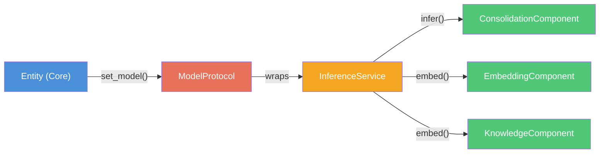

# ModelProtocol -- The Thinking Engine

The model is the entity's thinking engine. It generates text, embeds vectors, and drives behavior. Swap the model and the entity thinks differently -- that's a feature, not a limitation.

## What Models Do

A model provider wraps an external API or local inference engine behind a standard interface. The rest of the system never talks to Anthropic or Ollama directly -- it talks to `ModelProtocol`, and the model handles the translation.



The Entity creates an `InferenceService` wrapper around the model and passes it down to stack components. Components never see `ModelProtocol` directly -- they get the narrow `InferenceService` interface.

## ModelProtocol Interface

```python
@runtime_checkable
class ModelProtocol(Protocol):

    @property
    def model_id(self) -> str:
        """Identifier (e.g., 'claude-sonnet-4-5-20250929', 'llama3.2:latest')."""
        ...

    @property
    def capabilities(self) -> ModelCapabilities:
        """What this model can do."""
        ...

    def generate(
        self,
        messages: list[ModelMessage],
        *,
        tools: Optional[list[ToolDefinition]] = None,
        temperature: Optional[float] = None,
        max_tokens: Optional[int] = None,
        system: Optional[str] = None,
    ) -> ModelResponse:
        """Generate a complete response."""
        ...

    def stream(
        self,
        messages: list[ModelMessage],
        *,
        tools: Optional[list[ToolDefinition]] = None,
        temperature: Optional[float] = None,
        max_tokens: Optional[int] = None,
        system: Optional[str] = None,
    ) -> Iterator[ModelChunk]:
        """Stream a response chunk by chunk."""
        ...
```

### Supporting Types

| Type | Purpose |
|------|---------|
| `ModelCapabilities` | What the model supports: context window, max tokens, tool use, vision, streaming |
| `ModelMessage` | A conversation message with role, content, optional tool calls |
| `ModelResponse` | Complete response: content, tool calls, usage stats, stop reason |
| `ModelChunk` | A streaming chunk: partial content, is_final flag, usage on final chunk |
| `ToolDefinition` | A tool the model can call: name, description, JSON schema, handler |

## InferenceService

Stack components don't need the full `ModelProtocol`. They need two things: generate text and embed vectors. `InferenceService` is that narrow interface.

```python
@runtime_checkable
class InferenceService(Protocol):

    def infer(self, prompt: str, *, system: Optional[str] = None) -> str:
        """Generate text from a prompt. Returns the response string."""
        ...

    def embed(self, text: str) -> list[float]:
        """Embed text into a vector."""
        ...

    def embed_batch(self, texts: list[str]) -> list[list[float]]:
        """Batch embed. Default: loop over embed()."""
        ...

    @property
    def embedding_dimension(self) -> int:
        """Dimension of vectors produced by embed()."""
        ...

    @property
    def embedding_provider_id(self) -> str:
        """Stable ID for the current embedding source.
        Used by stacks to detect when re-indexing is needed."""
        ...
```

### How InferenceService Works

When you call `entity.set_model(model)`, the Entity:

1. Stores the model reference
2. Creates an `_InferenceServiceImpl` wrapping it
3. Calls `stack.on_model_changed(inference)` on the active stack
4. The stack propagates to all components via `component.set_inference(inference)`

The `_InferenceServiceImpl` routes `infer()` to `model.generate()` and uses a local `HashEmbedder` for `embed()` by default.

### HashEmbedder Fallback

When no model-level embedding is available, the system uses a local hash-based n-gram embedder. This provides functional (if lower-quality) semantic search without any external API:

- Provider ID: `ngram-v1`
- No network calls required
- Deterministic (same input always produces same vector)
- Lower quality than model-based embeddings, but always available

## Built-in Implementations

### AnthropicModel

Wraps the Anthropic Python SDK for Claude models.

```python
from kernle.models.anthropic import AnthropicModel
from kernle.protocols import ModelMessage

model = AnthropicModel()  # uses CLAUDE_API_KEY or ANTHROPIC_API_KEY env var
model = AnthropicModel(
    model_id="claude-sonnet-4-5-20250929",
    api_key="sk-...",
    max_tokens=4096,
)

response = model.generate([
    ModelMessage(role="user", content="Hello")
])
print(response.content)
```

**API Key Resolution** (in priority order):
1. Explicit `api_key=` parameter
2. `CLAUDE_API_KEY` environment variable
3. `ANTHROPIC_API_KEY` environment variable

**CLI Usage:**
```bash
# Bind via CLI (uses env var automatically)
kernle -s my-project model set claude

# Or with a specific model
kernle -s my-project model set claude --model-id claude-sonnet-4-5-20250929
```

**Capabilities:**
- 200k context window
- Tool use, vision, streaming
- System messages extracted to top-level `system` parameter (Anthropic API convention)

**Requirements:** `pip install anthropic` or `pip install kernle[anthropic]`

### OllamaModel

Connects to a local Ollama instance via HTTP REST API.

```python
from kernle.models.ollama import OllamaModel
from kernle.protocols import ModelMessage

model = OllamaModel(model_id="llama3.2:latest")
model = OllamaModel(
    model_id="mistral:7b",
    base_url="http://localhost:11434",
    context_window=8192,
    timeout=120,
)

response = model.generate([
    ModelMessage(role="user", content="Hello")
])
print(response.content)
```

**Capabilities:**
- Configurable context window (default 8192)
- Streaming support
- No tool use or vision (model-dependent)

**Requirements:** `pip install requests` and a running Ollama server

## Entry Point Registration

Model implementations register in the `kernle.models` entry point group:

```toml
# pyproject.toml
[project.entry-points."kernle.models"]
anthropic = "kernle.models.anthropic:AnthropicModel"
ollama = "kernle.models.ollama:OllamaModel"
```

The core discovers installed models via `discover_models()` and can instantiate them on demand.

## Building a Custom Model Provider

To integrate a new model provider, implement the `ModelProtocol` interface:

```python
from kernle.protocols import (
    ModelCapabilities,
    ModelChunk,
    ModelMessage,
    ModelResponse,
    ToolDefinition,
)

class MyModel:
    """Custom model provider."""

    def __init__(self, model_id: str = "my-model-v1"):
        self._model_id = model_id

    @property
    def model_id(self) -> str:
        return self._model_id

    @property
    def capabilities(self) -> ModelCapabilities:
        return ModelCapabilities(
            model_id=self._model_id,
            provider="my-provider",
            context_window=32000,
            max_output_tokens=4096,
            supports_tools=False,
            supports_vision=False,
            supports_streaming=True,
        )

    def generate(
        self,
        messages: list[ModelMessage],
        *,
        tools=None,
        temperature=None,
        max_tokens=None,
        system=None,
    ) -> ModelResponse:
        # Convert messages to your API format
        # Call your API
        # Return ModelResponse
        return ModelResponse(
            content="response text",
            usage={"input_tokens": 10, "output_tokens": 20},
            stop_reason="stop",
            model_id=self._model_id,
        )

    def stream(self, messages, **kwargs):
        # Yield ModelChunk objects
        yield ModelChunk(content="partial ")
        yield ModelChunk(content="response", is_final=True)
```

Register it as an entry point:

```toml
[project.entry-points."kernle.models"]
my-model = "my_package:MyModel"
```

Then bind it to an entity:

```python
from kernle.entity import Entity
from my_package import MyModel

entity = Entity()
entity.set_model(MyModel())
```

## Auto-Configuration

For CLI usage, Kernle can auto-configure a model from environment variables. The `process run` and `process exhaust` commands do this automatically. Detection priority:

1. `KERNLE_MODEL_PROVIDER` env var (forces a specific provider)
2. `CLAUDE_API_KEY` or `ANTHROPIC_API_KEY` → Anthropic
3. `OPENAI_API_KEY` → OpenAI
4. No key → graceful degradation (no model)

Override the model name with `KERNLE_MODEL`:

```bash
KERNLE_MODEL=claude-sonnet-4-5-20250929 kernle -s my-project process exhaust
```
