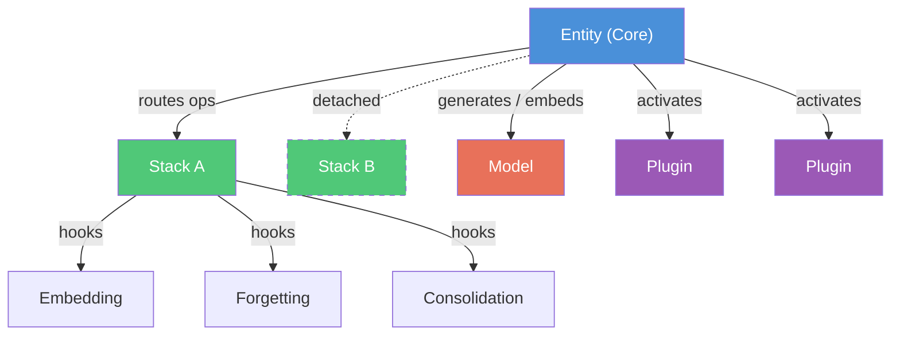

# Protocol System

Kernle uses a protocol-based composition architecture. Instead of one monolithic class, an entity is assembled from interchangeable components that communicate through defined interfaces.

## The Entity is the Composition

No single component *is* the entity. The entity emerges from the composition of all its parts:

- **Core** (Entity) coordinates everything -- routes operations, manages lifecycle
- **Stack** (SQLiteStack) stores and retrieves memories -- self-contained, portable
- **Plugins** add capabilities -- commerce, communications, analytics
- **Model** provides thinking -- generates text, embeds vectors
- **Components** extend the stack -- embedding, forgetting, emotional tagging

When you swap the model, the entity thinks differently. When you attach a different stack, it remembers different things. When you add a plugin, it gains new abilities. The entity is all of these together.



## Five Protocols

Every major component implements a protocol -- a Python `Protocol` class that defines its interface contract.

| Protocol | Role | Default Implementation | Analogy |
|----------|------|----------------------|---------|
| **CoreProtocol** | Bus / coordinator | `Entity` | Torso -- connects everything |
| **StackProtocol** | Memory container | `SQLiteStack` | Head -- stores knowledge |
| **PluginProtocol** | Capability extension | installed plugins | Limbs -- reach into the world |
| **ModelProtocol** | Thinking engine | `AnthropicModel`, `OllamaModel` | Heart -- drives behavior |
| **StackComponentProtocol** | Stack sub-plugin | Embedding, Forgetting, etc. | Organs -- internal functions |

Two supporting interfaces complete the picture:

| Interface | Role |
|-----------|------|
| **InferenceService** | Narrow model access for stack components (infer + embed) |
| **PluginContext** | What the core provides to plugins (mediated memory access) |

## Why Protocols?

**Interchangeability.** Swap SQLiteStack for PostgresStack without changing anything else. Replace Anthropic with Ollama and the entity keeps its memories but thinks differently.

**Testability.** Every protocol can be tested against a contract test suite. If your custom implementation passes the contract tests, it works with the system.

**Clean boundaries.** Plugins never touch stack internals. Stacks never see models directly. Components hook into the stack lifecycle without coupling to specific storage backends.

**Graceful degradation.** No model bound? Stack components that need inference skip their work instead of crashing. No stack attached? Plugins get `None` from memory operations and handle it.

## Entry Point Discovery

Components find each other through Python's `importlib.metadata` entry points. Each component type registers in a specific group:

| Entry Point Group | Discovers |
|-------------------|-----------|
| `kernle.plugins` | Plugin implementations |
| `kernle.stacks` | Stack implementations |
| `kernle.models` | Model implementations |
| `kernle.stack_components` | Stack component implementations |

Registration happens in `pyproject.toml`:

```toml
[project.entry-points."kernle.plugins"]
my-plugin = "my_package:MyPlugin"
```

The core scans these groups at startup to discover what's installed, then loads components on demand.

## Protocol Version

All protocols share a single version number (`PROTOCOL_VERSION = 1` in `protocols.py`). Plugins declare which version they were built against. The core checks compatibility on load:

- Plugin version matches core: load normally
- Plugin version is older: load with a warning
- Plugin version is newer than core: refuse to load (core is too old)

## Dive Deeper

<CardGroup cols={2}>
  <Card title="CoreProtocol" icon="circle-nodes" href="/protocol/core">
    The coordinator -- stack management, plugin lifecycle, operation routing.
  </Card>
  <Card title="StackProtocol" icon="layer-group" href="/protocol/stack">
    The memory container -- write, read, search, components, and working memory.
  </Card>
  <Card title="PluginProtocol" icon="puzzle-piece" href="/protocol/plugins">
    Building extensions -- lifecycle, tools, entry points, and a tutorial.
  </Card>
  <Card title="ModelProtocol" icon="brain" href="/protocol/models">
    The thinking engine -- generate, stream, embed, and capabilities.
  </Card>
</CardGroup>
