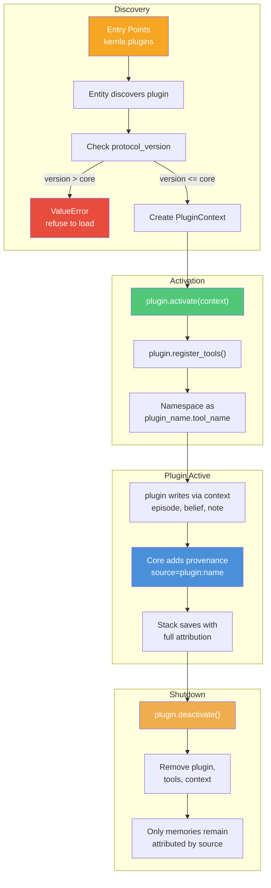

# PluginProtocol — Building Extensions

Plugins are capability extensions. They manage their own operational state and are removable without residue. When a plugin is unloaded, the only trace left behind is memories it wrote to the stack through its PluginContext.

## PluginProtocol Interface

### Properties

| Property | Type | Description |
|----------|------|-------------|
| `name` | `str` | Plugin identifier. Used for namespacing, config, data directory. |
| `version` | `str` | Semantic version of the plugin. |
| `protocol_version` | `int` | The `PROTOCOL_VERSION` this plugin was built against. |
| `description` | `str` | One-line description. |

### Methods

| Method | Signature | Description |
|--------|-----------|-------------|
| `capabilities` | `() -> list[str]` | What this plugin can do (e.g., `["commerce", "payments"]`). |
| `activate` | `(context: PluginContext) -> None` | Initialize the plugin with mediated core access. |
| `deactivate` | `() -> None` | Shut down, close connections, clean up resources. |
| `register_cli` | `(subparsers: Any) -> None` | Add subcommands to the core's CLI. |
| `register_tools` | `() -> list[ToolDefinition]` | Return tool definitions for MCP / model integration. |
| `on_load` | `(load_context: dict) -> None` | Contribute to `kernle load` working memory output. |
| `on_status` | `(status: dict) -> None` | Contribute to `kernle status` output. |
| `health_check` | `() -> PluginHealth` | Report whether the plugin is functioning correctly. |

## PluginContext Interface

The PluginContext is what the core provides to each plugin -- mediated access to memory, search, trust, configuration, and storage. The plugin never sees raw stacks, raw models, or raw connections.

All memory writes through the context are automatically attributed with `source="plugin:{plugin_name}"`.

### Properties

| Property | Type | Description |
|----------|------|-------------|
| `core_id` | `str` | The core this plugin is attached to. |
| `active_stack_id` | `Optional[str]` | Currently active stack's ID (`None` if no stack). |
| `plugin_name` | `str` | This plugin's name. |

### Memory Write Methods

All write methods return `Optional[str]` -- the memory ID on success, `None` if no active stack.

| Method | Key Parameters |
|--------|---------------|
| `episode` | `objective, outcome, *, lessons, repeat, avoid, tags, context` |
| `belief` | `statement, *, belief_type="fact", confidence=0.8, context` |
| `value` | `name, statement, *, priority=50, context` |
| `goal` | `title, *, description, goal_type="task", priority="medium"` |
| `note` | `content, *, note_type="note", tags, context` |
| `relationship` | `other_entity_id, *, trust_level, interaction_type, notes, entity_type` |
| `raw` | `content, *, tags` |

### Memory Read Methods

| Method | Signature |
|--------|-----------|
| `search` | `(query, *, limit=10, record_types=None, context=None) -> list[SearchResult]` |
| `get_relationships` | `(*, entity_id=None, entity_type=None, min_trust=None) -> list[Relationship]` |
| `get_goals` | `(*, status=None, context=None) -> list[Goal]` |

### Trust Methods

| Method | Signature |
|--------|-----------|
| `trust_set` | `(entity, domain, score, *, evidence=None) -> Optional[str]` |
| `trust_get` | `(entity, *, domain=None) -> list[TrustAssessment]` |

### Plugin Storage and Configuration

| Method | Signature | Description |
|--------|-----------|-------------|
| `get_data_dir` | `() -> Path` | Directory for plugin operational state (`~/.kernle/plugins/{name}/data/`). |
| `get_config` | `(key, default=None) -> Any` | Read plugin-specific configuration. |
| `get_secret` | `(key) -> Optional[str]` | Read a secret (API key, credential). In-memory only. |

## Plugin Lifecycle



After deactivation, the plugin is gone completely. The only residue is memories written to the stack through the context during the plugin's lifetime. Those memories belong to the stack now, attributed to the plugin by source.

## Tool Registration

Plugins expose tools to the model through MCP (Model Context Protocol). Each tool is defined as a `ToolDefinition`:

```python
from kernle.protocols import ToolDefinition

def register_tools(self) -> list[ToolDefinition]:
    return [
        ToolDefinition(
            name="check_balance",
            description="Check the wallet balance",
            input_schema={
                "type": "object",
                "properties": {
                    "currency": {
                        "type": "string",
                        "description": "Currency to check",
                    }
                },
            },
            handler=self._handle_check_balance,
        ),
    ]
```

The core namespaces tools as `{plugin_name}.{tool_name}` for MCP dispatch. When the model calls `chainbased.check_balance`, the core routes it to the chainbased plugin's handler.

## Protocol Version Compatibility

Plugins declare which `PROTOCOL_VERSION` they were built against. The core enforces compatibility:

| Plugin Version | Core Version | Result |
|---------------|-------------|--------|
| 1 | 1 | Load normally |
| 1 | 2 | Load with warning (core is newer) |
| 2 | 1 | **Refuse to load** (core is too old) |

This prevents silent breakage when protocol interfaces change.

## Entry Point Registration

Plugins are discovered through Python entry points. Register in your `pyproject.toml`:

```toml
[project.entry-points."kernle.plugins"]
my-plugin = "my_package.plugin:MyPlugin"
```

After installing the package (`pip install -e .`), the plugin is discoverable:

```python
entity = Entity(core_id="test")
available = entity.discover_plugins()
# [PluginInfo(name="my-plugin", version="0.1.0", ...)]
```

## Building Your First Plugin

Here is a complete example of a simple plugin that tracks conversation topics.

### 1. Define the Plugin Class

```python
# my_topics_plugin/plugin.py
from pathlib import Path
from typing import Any, Optional

from kernle.protocols import (
    PluginContext,
    PluginHealth,
    ToolDefinition,
)


class TopicsPlugin:
    """Tracks conversation topics and their frequency."""

    @property
    def name(self) -> str:
        return "topics"

    @property
    def version(self) -> str:
        return "0.1.0"

    @property
    def protocol_version(self) -> int:
        return 1

    @property
    def description(self) -> str:
        return "Track conversation topics"

    def capabilities(self) -> list[str]:
        return ["topic-tracking", "analytics"]

    def activate(self, context: PluginContext) -> None:
        self._context = context
        self._topics: dict[str, int] = {}
        # Restore state from data dir if it exists
        state_file = context.get_data_dir() / "topics.json"
        if state_file.exists():
            import json
            self._topics = json.loads(state_file.read_text())

    def deactivate(self) -> None:
        # Persist state before shutdown
        import json
        state_file = self._context.get_data_dir() / "topics.json"
        state_file.write_text(json.dumps(self._topics))
        self._context = None

    def register_cli(self, subparsers: Any) -> None:
        parser = subparsers.add_parser(
            "topics", help="Show tracked topics"
        )
        parser.set_defaults(func=self._cli_topics)

    def _cli_topics(self, args: Any) -> None:
        for topic, count in sorted(
            self._topics.items(), key=lambda x: x[1], reverse=True
        ):
            print(f"  {topic}: {count}")

    def register_tools(self) -> list[ToolDefinition]:
        return [
            ToolDefinition(
                name="track_topic",
                description="Record a conversation topic",
                input_schema={
                    "type": "object",
                    "properties": {
                        "topic": {
                            "type": "string",
                            "description": "The topic to track",
                        }
                    },
                    "required": ["topic"],
                },
                handler=self._handle_track,
            ),
            ToolDefinition(
                name="get_topics",
                description="Get all tracked topics with counts",
                input_schema={"type": "object", "properties": {}},
                handler=self._handle_get,
            ),
        ]

    def _handle_track(self, topic: str) -> dict:
        self._topics[topic] = self._topics.get(topic, 0) + 1
        # Record as an episode through the context
        self._context.episode(
            f"Discussed topic: {topic}",
            f"Topic '{topic}' tracked ({self._topics[topic]} times)",
            tags=["topic-tracking"],
        )
        return {"tracked": topic, "count": self._topics[topic]}

    def _handle_get(self) -> dict:
        return {"topics": self._topics}

    def on_load(self, load_context: dict[str, Any]) -> None:
        if self._topics:
            load_context["topics"] = {
                "top_topics": sorted(
                    self._topics.items(),
                    key=lambda x: x[1],
                    reverse=True,
                )[:5]
            }

    def on_status(self, status: dict[str, Any]) -> None:
        status["topics"] = {
            "total_topics": len(self._topics),
            "total_mentions": sum(self._topics.values()),
        }

    def health_check(self) -> PluginHealth:
        return PluginHealth(
            healthy=True,
            message=f"Tracking {len(self._topics)} topics",
        )
```

### 2. Register as Entry Point

```toml
# pyproject.toml
[project]
name = "kernle-topics-plugin"
version = "0.1.0"

[project.entry-points."kernle.plugins"]
topics = "my_topics_plugin.plugin:TopicsPlugin"
```

### 3. Install and Use

```bash
pip install -e .

# Verify discovery
kernle status
# Should show: topics plugin available

# Use via MCP
# Model can call topics.track_topic and topics.get_topics
```

## Real-World Plugins

### chainbased (Commerce)

The chainbased plugin adds wallet management, job marketplace, skills registry, and escrow to a kernle entity. It implements `PluginProtocol` with capabilities like `["wallet", "jobs", "skills", "escrow"]`.

- Uses its own SQLite database in the plugin data directory
- Registers CLI commands: `wallet`, `jobs`, `skills`
- Registers MCP tools for model integration
- Writes episodes through PluginContext when transactions complete

### fatline (Communications)

The fatline plugin adds an agent registry and Ed25519 cryptographic identity. It enables secure inter-entity communication.

- Manages its own agent registry database
- Provides cryptographic signing and verification
- Registers tools for message signing and discovery
- Uses `get_data_dir()` for key storage

Both plugins are registered as `kernle.plugins` entry points in their respective `pyproject.toml` files and are discovered automatically when installed.
