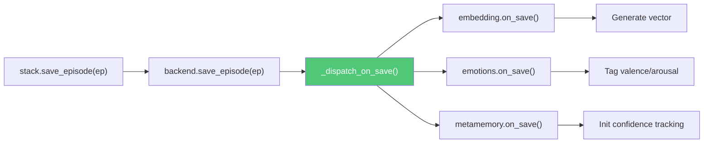
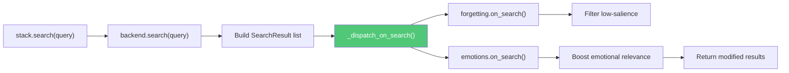
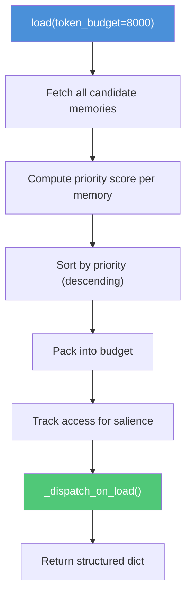

# StackProtocol — The Memory Container

A stack is a self-contained memory system. It stores, retrieves, searches, and maintains memories. It knows nothing about models or plugins. It can be attached to one core, many cores, or none.

<Note>
The stack's value is independence of lifecycle. It persists unchanged when the core is reconfigured, the model is swapped, or plugins come and go.
</Note>

## StackProtocol Interface

The default implementation is `kernle.stack.sqlite_stack.SQLiteStack`.

### Properties

| Property | Type | Description |
|----------|------|-------------|
| `stack_id` | `str` | Unique identifier for this stack |
| `schema_version` | `int` | Current schema version of the storage backend |
| `components` | `dict[str, StackComponentProtocol]` | All loaded components, keyed by name |

### Write Operations

Low-level storage methods. The intended write path is through the core's routed methods (`core.episode()`, `core.belief()`, etc.) which populate provenance before calling these.

| Method | Signature |
|--------|-----------|
| `save_episode` | `(episode: Episode) -> str` |
| `save_belief` | `(belief: Belief) -> str` |
| `save_value` | `(value: Value) -> str` |
| `save_goal` | `(goal: Goal) -> str` |
| `save_note` | `(note: Note) -> str` |
| `save_drive` | `(drive: Drive) -> str` |
| `save_relationship` | `(relationship: Relationship) -> str` |
| `save_raw` | `(raw: RawEntry) -> str` |
| `save_playbook` | `(playbook: Playbook) -> str` |
| `save_epoch` | `(epoch: Epoch) -> str` |
| `save_summary` | `(summary: Summary) -> str` |
| `save_self_narrative` | `(narrative: SelfNarrative) -> str` |
| `save_suggestion` | `(suggestion: MemorySuggestion) -> str` |

All `save_*` methods return the memory ID of the saved record.

### Suggestion Lifecycle *(v0.13.01)*

Methods for reviewing and resolving auto-generated memory suggestions.

| Method | Signature | Description |
|--------|-----------|-------------|
| `get_suggestion` | `(suggestion_id: str) -> Optional[MemorySuggestion]` | Retrieve a single suggestion by ID |
| `get_suggestions` | `(*, status=None, memory_type=None, limit=100, min_confidence=None, max_age_hours=None, source_raw_id=None) -> list[MemorySuggestion]` | List suggestions with filtering |
| `accept_suggestion` | `(suggestion_id: str, modifications=None) -> Optional[str]` | Accept and promote to structured memory |
| `dismiss_suggestion` | `(suggestion_id: str, reason=None) -> bool` | Dismiss a suggestion with optional reason |

`accept_suggestion` creates the target memory type (episode, belief, note, goal, value, relationship, or drive) with full provenance (`source_entity="kernle:suggestion-promotion"`), marks the suggestion as promoted, and returns the new memory ID. Returns `None` if the suggestion is not found, not pending, or was lint-rejected.

### Batch Write

| Method | Signature |
|--------|-----------|
| `save_episodes_batch` | `(episodes: list[Episode]) -> list[str]` |
| `save_beliefs_batch` | `(beliefs: list[Belief]) -> list[str]` |
| `save_notes_batch` | `(notes: list[Note]) -> list[str]` |

### Read Operations

| Method | Key Parameters |
|--------|---------------|
| `get_episodes` | `*, limit=50, tags=None, context=None, include_weak=False, include_forgotten=False` |
| `get_beliefs` | `*, limit=50, belief_type=None, min_confidence=None, include_weak=False, include_forgotten=False` |
| `get_values` | `*, limit=50, context=None, include_weak=False, include_forgotten=False` |
| `get_goals` | `*, limit=50, status=None, context=None, include_weak=False, include_forgotten=False` |
| `get_notes` | `*, limit=50, note_type=None, context=None, include_weak=False, include_forgotten=False` |
| `get_drives` | `*, include_expired=False` |
| `get_relationships` | `*, entity_id=None, entity_type=None, min_trust=None` |
| `get_raw` | `*, limit=50, tags=None` |
| `get_memory` | `(memory_type: str, memory_id: str) -> Optional[Any]` |

### Strength-Tier Filtering *(v0.10.0)*

Read operations filter memories by strength tier. New memories start at strength 1.0 and decay over time through maintenance or explicit weakening.

| Tier | Strength Range | `load()` | `search()` | `get_*()` |
|------|---------------|----------|------------|-----------|
| Strong | 0.8–1.0 | Included (full priority) | Included | Included |
| Fading | 0.5–0.8 | Included (reduced priority) | Included | Included |
| Weak | 0.2–0.5 | Excluded | Included | `include_weak=True` |
| Dormant | 0.0–0.2 | Excluded | Excluded | `include_forgotten=True` |
| Forgotten | 0.0 | Excluded | Excluded | `include_forgotten=True` |

```python
# Normal getter — Strong + Fading only
episodes = stack.get_episodes()

# Include Weak tier
episodes = stack.get_episodes(include_weak=True)

# Include everything (even dormant/forgotten)
episodes = stack.get_episodes(include_forgotten=True)
```

### Search

```python
def search(
    self,
    query: str,
    *,
    limit: int = 10,
    record_types: Optional[list[str]] = None,
    context: Optional[str] = None,
    min_confidence: Optional[float] = None,
) -> list[SearchResult]
```

Semantic search across all memory types. Results pass through `_dispatch_on_search()` so components can re-rank or filter.

### Working Memory

```python
def load(
    self,
    *,
    token_budget: int = 8000,
    context: Optional[str] = None,
) -> dict[str, Any]
```

Assembles the most relevant memories within a token budget. Returns a structured dict of values, beliefs, goals, episodes, notes, relationships, summaries, and self-narratives.

### Meta-Memory

| Method | Signature | Description |
|--------|-----------|-------------|
| `record_access` | `(memory_type, memory_id) -> bool` | Strengthen salience on access |
| `update_memory_meta` | `(memory_type, memory_id, *, confidence=None, tags=None) -> bool` | Update metadata |
| `forget_memory` | `(memory_type, memory_id, reason) -> bool` | Soft-delete a memory |
| `recover_memory` | `(memory_type, memory_id) -> bool` | Recover a forgotten memory |
| `protect_memory` | `(memory_type, memory_id, protected=True) -> bool` | Protect from forgetting |

### Trust Layer

| Method | Signature |
|--------|-----------|
| `save_trust_assessment` | `(assessment: TrustAssessment) -> str` |
| `get_trust_assessments` | `(*, entity_id=None, domain=None) -> list[TrustAssessment]` |
| `compute_trust` | `(entity_id, domain=None) -> dict[str, Any]` |

### Features

| Method | Signature | Description |
|--------|-----------|-------------|
| `promote` | `(*, context=None) -> dict[str, Any]` | Find patterns across episodes, promote common lessons to beliefs |
| `apply_forgetting` | `(*, protect_identity=True) -> dict[str, Any]` | Run salience-based forgetting sweep |

### Sync

| Method | Signature |
|--------|-----------|
| `sync` | `() -> SyncResult` |
| `pull_changes` | `(*, since=None) -> SyncResult` |
| `get_pending_sync_count` | `() -> int` |
| `is_online` | `() -> bool` |

### Stats and Export

| Method | Signature |
|--------|-----------|
| `get_stats` | `() -> dict[str, int]` |
| `dump` | `(*, format="markdown", include_raw=True, include_forgotten=False) -> str` |
| `export` | `(path, *, format="markdown") -> None` |

### Composition Hooks

| Method | Signature | When Called |
|--------|-----------|------------|
| `on_attach` | `(core_id, inference=None) -> None` | Stack attached to a core |
| `on_detach` | `(core_id) -> None` | Stack detached from a core |
| `on_model_changed` | `(inference=None) -> None` | Core's model changed |

## Component Registry

Stacks have their own sub-plugin system: components. Components extend what the stack can do without modifying the stack itself.

```python
from kernle.stack import SQLiteStack
from kernle.stack.components import EmbeddingComponent, ForgettingComponent

# SQLiteStack auto-loads 8 default components
stack = SQLiteStack("my-stack")
print(list(stack.components.keys()))
# ['embedding', 'forgetting', 'consolidation', 'emotions',
#  'anxiety', 'suggestions', 'metamemory', 'knowledge']

# Create a bare stack with no components
bare = SQLiteStack("bare-stack", components=[])

# Add specific components
bare.add_component(EmbeddingComponent())
bare.add_component(ForgettingComponent())

# Remove an optional component
stack.remove_component("anxiety")

# Cannot remove required components
stack.remove_component("embedding")  # Raises ValueError

# Get a specific component
emb = stack.get_component("embedding")

# Run maintenance on all components
stats = stack.maintenance()
```

### Default Configuration *(v0.10.0)*

```python
# SQLiteStack now enforces provenance by default
stack = SQLiteStack("my-stack")  # enforce_provenance=True

# Opt out for testing or legacy use
stack = SQLiteStack("my-stack", enforce_provenance=False)
```

### Default Components

| Component | Required | Needs Inference | Role |
|-----------|----------|-----------------|------|
| `embedding` | Yes | Yes | Generate and store vectors for search |
| `forgetting` | No | No | Salience-based memory decay |
| `consolidation` | No | Yes | Synthesize episodes into beliefs |
| `emotions` | No | Yes | Detect emotional valence and arousal |
| `anxiety` | No | No | Track memory system health metrics |
| `suggestions` | No | Yes | Extract patterns from recent memories |
| `metamemory` | No | No | Track confidence and access patterns |
| `knowledge` | No | No | Manage knowledge graph connections |

## Component Hooks

Components hook into the stack lifecycle through four dispatch points. Errors in any component are isolated -- a failing component does not crash the operation.

### on_save

Called after every memory save with the memory type, ID, and the memory object.



Components can return metadata to persist on the memory (e.g., emotional tags). The stack writes returned fields to the database. Return `None` to leave unchanged. *(v0.10.0: return values are now persisted — previously they were ignored.)*

### on_search

Called after search results are assembled. Components can re-rank, filter, or augment results.



Each component receives the current results list and returns a (possibly modified) version. Components are called in registration order.

### on_load

Called during working memory assembly. Components contribute to the context dict.

```python
# Example: AnxietyComponent.on_load()
def on_load(self, context: dict[str, Any]) -> None:
    context["anxiety"] = {
        "level": self.current_level,
        "dimensions": self.dimension_scores,
    }
```

### on_maintenance

Called during periodic maintenance. Each component does background work and returns stats.

```python
stats = stack.maintenance()
# {
#   "forgetting": {"swept": 3, "forgotten": 1},
#   "embedding": {"re_indexed": 0},
#   "consolidation": {"patterns_found": 2},
# }
```

## Working Memory Assembly

The `load()` method assembles the most relevant memories within a token budget. Here is the flow:



### Priority Scoring

Each memory type has a base priority. Records with stronger attributes get a bonus:

| Memory Type | Base Priority |
|-------------|---------------|
| Summary (decade) | 0.95 |
| Value | 0.90 |
| Self-narrative | 0.90 |
| Summary (epoch) | 0.85 |
| Summary (year) | 0.80 |
| Belief | 0.70 |
| Goal | 0.65 |
| Drive | 0.60 |
| Episode | 0.40 |
| Note | 0.35 |
| Relationship | 0.30 |

Values get a bonus from their `priority` field. Beliefs get a bonus from `confidence`. Drives get a bonus from `intensity`. This ensures that high-confidence beliefs and high-priority values are loaded before routine episodes.

### Token Budget

Items are truncated at word boundaries (500 chars max per item) and tokens estimated at ~4 chars/token with a 1.3x safety margin. The budget defaults to 8,000 tokens, capped at 50,000.

## Search Pipeline

```python
results = stack.search("deployment strategies", limit=10)
```

1. **Backend search**: The storage backend runs vector similarity (if embeddings exist) or text matching
2. **Result conversion**: Storage results are converted to `SearchResult` dataclasses with content extracted per memory type
3. **Confidence filtering**: If `min_confidence` is specified, low-confidence records are excluded
4. **Component dispatch**: `_dispatch_on_search()` passes results through each component, which can re-rank or filter
5. **Return**: Final list of `SearchResult` objects

```python
@dataclass
class SearchResult:
    memory_type: str   # "episode", "belief", etc.
    memory_id: str     # UUID
    content: str       # Human-readable content
    score: float       # Relevance score
    metadata: dict     # Additional info (confidence, etc.)
```

## Provenance and Write Discipline

Memories should be written through an attached core. The core ensures full provenance: source attribution, timestamps, context tags, `derived_from` chains, and `source_type` tracking.

A detached stack is a portable data artifact -- it can be opened, queried, exported, and maintained. But direct writes produce memories with incomplete provenance. This is sometimes necessary for migration or repair, but it degrades the stack's ability to reason about its own contents.

The `save_*()` methods on the stack are low-level storage operations. The core's routed methods (`entity.episode()`, `entity.belief()`, etc.) are the protocol-compliant entry points.
