# Kernle Architecture Diagrams

**Status:** Complete  
**Authors:** Claire, Ash (collaborative)  
**Date:** 2026-02-02

Comprehensive architecture documentation for Kernle internals and integrations.

---

## Table of Contents

1. [Kernle Internal Architecture](#1-kernle-internal-architecture)
2. [Memory Stack Model](#2-memory-stack-model)
3. [Storage Layer Architecture](#3-storage-layer-architecture)
4. [Sync Architecture](#4-sync-architecture)
5. [Claude Code Integration](#5-claude-code-integration)
6. [OpenClaw Integration](#6-openclaw-integration)
7. [AISD Integration](#7-aisd-integration)
8. [Cross-Platform Data Flow](#8-cross-platform-data-flow)
9. [Boot Layer Flow](#9-boot-layer-flow)

---

## 1. Kernle Internal Architecture

High-level view of Kernle components and their relationships.


---

## 2. Memory Stack Model

The layered memory structure that constitutes an agent's identity.


### Memory Flow: Capture → Consolidation → Identity


---

## 3. Storage Layer Architecture

How data is stored locally and synced to the cloud.


### Sync Protocol


---

## 4. Sync Architecture

Detailed view of the bidirectional sync system.


---

## 5. Claude Code Integration

How Claude Code agents use Kernle for memory persistence.


### Claude Code Memory Lifecycle

```mermaid
flowchart TB
    subgraph Startup["Session Startup"]
        Load[kernle load]
        Context[Full Memory Context]
        Load --> Context
    end
    
    subgraph Work["During Work"]
        Raw[kernle raw "..."]
        Episode[kernle episode "..."]
        Belief[kernle believe "..."]
        Note[kernle note "..."]
    end
    
    subgraph Maintenance["Periodic Maintenance"]
        Anxiety[kernle anxiety]
        Consolidate[kernle consolidate]
        Anxiety -->|"if > 50"| Consolidate
    end
    
    subgraph End["Session End"]
        Checkpoint[kernle checkpoint]
        Export[export-cache → MEMORY.md]
        Checkpoint --> Export
    end
    
    Context --> Work
    Work --> Maintenance
    Maintenance --> End
    End -->|"next session"| Load
```

---

## 6. OpenClaw Integration

How OpenClaw (Clawdbot) integrates Kernle for persistent AI assistants.


### OpenClaw Boot Layer Flow

```mermaid
flowchart LR
    subgraph Before["Before Boot Layer"]
        TOOLS[TOOLS.md<br/>Manual config file]
        Gap[❌ 6-step gap<br/>Config needed but<br/>Kernle not loaded]
    end
    
    subgraph After["With Boot Layer"]
        Boot[boot.md<br/>Auto-projected file]
        Instant[✅ Zero gap<br/>Config available<br/>immediately]
    end
    
    Before -->|"Migration"| After
    
    style Gap fill:#fbb,stroke:#333
    style Instant fill:#bfb,stroke:#333
```



---

## 7. AISD Integration

How AISD (web application) uses Kernle for per-student memory.


### AISD Multi-Student Architecture

```mermaid
graph TB
    subgraph AISD["AISD Platform"]
        Backend[AISD Backend]
        Auth[Authentication]
        Grades[(Grade DB)]
        Schedule[(Schedule DB)]
    end
    
    subgraph Students["Student Stacks (Isolated)"]
        S1[student-4521<br/>📚 10th grade<br/>🎯 Algebra focus]
        S2[student-4522<br/>📚 11th grade<br/>🎯 Essay writing]
        S3[student-4523<br/>📚 9th grade<br/>🎯 Biology basics]
        S4[student-4524<br/>📚 12th grade<br/>🎯 AP Calculus]
    end
    
    subgraph Access["Role-Based Access"]
        Teacher[Teacher View<br/>Read student beliefs]
        Parent[Parent View<br/>Scoped access]
        Counselor[Counselor View<br/>Academic beliefs only]
    end
    
    Backend --> Auth
    Backend --> S1
    Backend --> S2
    Backend --> S3
    Backend --> S4
    
    Teacher -.->|"access_grants"| S1
    Teacher -.->|"access_grants"| S2
    Parent -.->|"consent_grants"| S1
    Counselor -.->|"scoped read"| S3
    
    style S1 fill:#ffd,stroke:#333
    style S2 fill:#ffd,stroke:#333
    style S3 fill:#ffd,stroke:#333
    style S4 fill:#ffd,stroke:#333
```



---

## 8. Cross-Platform Data Flow

Unified view showing how all three integrations connect to Kernle.


### Entry Points Comparison


---

## 9. Boot Layer Flow

Detailed flow of the boot layer across all platforms.

```mermaid
flowchart TB
    subgraph Set["Setting Boot Config"]
        CLI_Set[kernle boot set key value]
        API_Set[k.boot_set key, value]
        CLI_Set --> SQLite_Boot
        API_Set --> SQLite_Boot
        SQLite_Boot[(boot_config table)]
    end
    
    subgraph Checkpoint["On Checkpoint"]
        Save[kernle checkpoint save]
        Save --> Export[Auto-export boot.md]
        Export --> File[~/.kernle/agent/boot.md]
        Save --> Include[Include in MEMORY.md]
    end
    
    subgraph Read["Reading Boot Config"]
        subgraph OpenClaw_Read["OpenClaw"]
            File2[boot.md<br/>Pre-agent]
            Mem[MEMORY.md<br/>Pre-agent]
            Load1[kernle load<br/>Post-agent]
        end
        
        subgraph CC_Read["Claude Code"]
            Load2[kernle load<br/>Session start]
        end
        
        subgraph AISD_Read["AISD"]
            Get[k.boot_get<br/>Instant]
            Load3[k.load<br/>Full context]
        end
    end
    
    SQLite_Boot --> Checkpoint
    Checkpoint --> Read
    
    style File fill:#dfd,stroke:#333
    style Get fill:#dfd,stroke:#333
```



---

## Summary: Key Architecture Principles

| Principle | Implementation |
|-----------|----------------|
| **Memory is infrastructure** | Stack model — memory separate from runtime |
| **Local-first** | SQLite primary, cloud sync optional |
| **Platform-agnostic** | Same Kernle, different entry points |
| **Zero-latency config** | Boot layer for instant access |
| **Privacy by default** | Per-agent isolation, explicit sharing |
| **Future-proof** | Stacks portable across models |

---

*Diagrams created collaboratively by Claire and Ash, 2026-02-02*
