# Kernle Architecture Diagrams

> **Architecture reference.** All diagrams use Mermaid syntax.
> Source of truth: the codebase at `emergent-instruments/kernle`.

## Implementation Status

This document describes both **current** and **target** architecture. The table below
tracks what's shipped vs. what's planned.

| Component | Status | Notes |
|-----------|--------|-------|
| **Kernle Core** (§1) | ✅ Shipped | v0.2.4 — memory types, storage, priority scoring, boot config |
| **Cloud Sync** (§2.1–2.3) | ✅ Shipped | Push/pull working, schema aligned (PR #78) |
| **Authentication** (§2.4) | ✅ Shipped | JWT + API keys, fail-closed, rate limiting |
| **Payment Pipeline** (§2.5) | ⚠️ Testnet | Verified on Base Sepolia; mainnet pending |
| **OpenClaw Gateway** (§3.1) | ✅ Shipped | Channels, heartbeat, cron, workspace injection |
| **Session-end checkpoint** (§3.2) | ✅ Shipped | `memoryFlush` triggers Kernle checkpoint before compaction |
| **Session-start refresh** (§3.2) | 🔧 In Progress | `kernle-memory-refresh` custom hook built, testing on gateway |
| **Boot Config** (§3.3) | ✅ Shipped | v0.2.4 — key/value store, integrated into load/export-cache |
| **Multi-Agent / Gateway-to-Gateway** (§3.4) | ⚠️ Partial | Device pairing complete; wake calls have token auth issue |
| **Claude Code Integration** (§4) | ✅ Shipped | AGENTS.md instructions + memoryFlush + export-cache |
| **AISD Integration** (§5) | 📋 Spec Only | Architecture defined; no AISD client exists yet |
| **Bettik** (separate doc) | 📋 Spec Only | Application layer service — architecture drafted |
| **Privacy Fields** (§7.4) | 📋 Spec Only | Phase 8 spec complete (PR #53); implementation pending |
| **Forgetting** (§7.3) | ✅ Shipped | Salience decay + tombstoning implemented |

### Session-Start Refresh: Current vs. Target

**Current architecture:**
- Session ends → `memoryFlush` fires → agent runs `kernle checkpoint` → MEMORY.md updated via `export-cache` ✅
- Session starts → MEMORY.md from disk is injected (may be stale if previous session crashed) ⚠️
- Agent runs `kernle -a {id} load` after waking (per AGENTS.md instructions) ✅

**Target architecture (in progress):**
- `kernle-memory-refresh` hook fires on `agent:bootstrap` (before file injection)
- Hook runs `kernle export-cache` → MEMORY.md content replaced with fresh state
- Agent always wakes with current memory, even after crashes

**Blocker:** Custom hook handler loading verified; end-to-end testing in progress on Ash's gateway.

---

## Table of Contents

1. [Kernle Core Architecture](#1-kernle-core-architecture)
2. [Cloud Infrastructure](#2-cloud-infrastructure)
3. [OpenClaw Integration](#3-openclaw-integration)
4. [Claude Code / Coding Agent Integration](#4-claude-code--coding-agent-integration)
5. [AISD (AI Student Dashboard) Integration](#5-aisd-ai-student-dashboard-integration)
6. [Data Flow Diagrams](#6-data-flow-diagrams)
7. [Security Architecture](#7-security-architecture)

---

## 1. Kernle Core Architecture

### 1.1 System Overview

The Kernle engine (`kernle/core.py`) is a stratified memory system. The `Kernle` class composes six feature mixins (Anxiety, Emotions, Forgetting, Knowledge, MetaMemory, Suggestions) on top of a pluggable storage backend.


### 1.2 Memory Type Hierarchy

Memory is stratified from raw input to refined identity. Each layer builds on the one below.

```mermaid
graph BT
    RAW["🔤 Raw Entries<br/>Unprocessed captures<br/>(input buffer)"]
    EP["📖 Episodes<br/>Experiences with objectives,<br/>outcomes & lessons"]
    NOTE["📝 Notes<br/>Decisions, insights,<br/>observations, quotes"]
    BEL["💡 Beliefs<br/>Patterns, principles,<br/>held truths<br/>(confidence 0.0–1.0)"]
    PB["📋 Playbooks<br/>Procedural knowledge<br/>trigger → steps → recovery"]
    GOAL["🎯 Goals<br/>Intentions & objectives<br/>(status: active/done/dropped)"]
    VAL["⭐ Values<br/>Core principles<br/>(priority 0–100, protected by default)"]
    DRV["🔥 Drives<br/>Fundamental motivations<br/>(intensity 0.0–1.0)"]
    REL["🤝 Relationships<br/>Connections to entities<br/>(sentiment -1.0 to 1.0)"]

    RAW -->|"consolidation"| EP
    RAW -->|"direct capture"| NOTE
    EP -->|"promotion"| BEL
    EP -->|"lesson synthesis"| PB
    BEL -->|"formation"| VAL
    NOTE -->|"promotion"| BEL
    EP -->|"goal discovery"| GOAL
    EP -->|"entity modeling"| REL
    BEL -->|"motivation synthesis"| DRV

    style RAW fill:#888,color:#fff
    style EP fill:#4a90d9,color:#fff
    style NOTE fill:#5ba0c9,color:#fff
    style BEL fill:#d9a04a,color:#fff
    style PB fill:#c97a3b,color:#fff
    style GOAL fill:#2d8659,color:#fff
    style VAL fill:#d94a4a,color:#fff
    style DRV fill:#9b59b6,color:#fff
    style REL fill:#3498db,color:#fff
```



### 1.3 Storage Schema (SQLite — Schema Version 15)

All memory tables share common fields for sync, provenance, forgetting, and privacy.


### 1.4 Core Engine Operations

```mermaid
graph LR
    subgraph "Load (Budget-Aware)"
        L1["Fetch all candidates<br/>from storage"]
        L2["Score each item<br/>compute_priority_score()"]
        L3["Sort by priority<br/>(values > beliefs > goals<br/>> drives > episodes > notes)"]
        L4["Fill token budget<br/>(default 8000, max 50000)"]
        L5["Truncate long items<br/>at word boundaries"]
        L1 --> L2 --> L3 --> L4 --> L5
    end

    subgraph "Checkpoint"
        C1["Save task + pending<br/>+ context"]
        C2["Write to<br/>~/.kernle/checkpoints/"]
        C3["Auto-sync if enabled"]
        C1 --> C2 --> C3
    end

    subgraph "Promotion"
        CO1["Gather recent<br/>episodes (≥3)"]
        CO2["Extract lessons<br/>across episodes"]
        CO3["Count recurring<br/>patterns (≥2)"]
        CO4["Promote to<br/>beliefs/notes"]
        CO1 --> CO2 --> CO3 --> CO4
    end

    subgraph "Export Cache"
        E1["Read boot config"]
        E2["Read values, goals,<br/>beliefs (conf ≥ 0.4)"]
        E3["Include checkpoint<br/>if available"]
        E4["Format as MEMORY.md"]
        E1 --> E2 --> E3 --> E4
    end

    subgraph "Forgetting"
        F1["Calculate salience<br/>(access × recency)"]
        F2["Identify low-salience<br/>non-protected items"]
        F3["Tombstone:<br/>is_forgotten=1"]
        F4["Preserve in DB<br/>(never physically delete)"]
        F1 --> F2 --> F3 --> F4
    end
```



### 1.5 Priority Scoring

The `compute_priority_score()` function determines what gets loaded within the token budget. Weighted 60% type priority + 40% record-specific factor.


---

## 2. Cloud Infrastructure

### 2.1 Backend Architecture


### 2.2 Sync Push Flow


### 2.3 Sync Pull Flow


> **Design Decision — Array Merge Strategy:** During sync, array fields (e.g., `lessons`, `tags`, `emotional_tags`, `source_episodes`, `derived_from`, `context_tags`) are merged as set unions rather than overwritten. This preserves additions from both local and cloud. Max merged array size is capped at 500 elements to prevent resource exhaustion.

### 2.4 Authentication Architecture


### 2.5 Payment Pipeline


> **Design Decision — No Sync Frequency Limits:** Every tier gets unlimited sync. Restricting sync frequency risks lost memories due to economics — that contradicts memory sovereignty. The real cost is storage, not API calls.

> **Design Decision — Agent Counting:** Only agents with active cloud sync count toward stack limits. Ephemeral/specialist agents that never call `kernle sync` are free. This ensures parallel work patterns don't incur surprise costs.

---

## 3. OpenClaw Integration

### 3.1 Gateway Architecture


### 3.2 Memory Lifecycle in a Session

The memory lifecycle uses a **belt-and-suspenders** pattern: MEMORY.md is refreshed
both at session start (guaranteed) and session end (best-effort). SQLite is always
the source of truth; MEMORY.md is a read-only projection.


**Key design decision:** The `kernle-memory-refresh` hook runs on `agent:bootstrap`
(before workspace file injection), ensuring the agent always wakes with current
memory. The compaction flush is a best-effort optimization — if it fails (crash,
timeout), no data is lost because the next session will regenerate MEMORY.md from
SQLite.

### 3.3 Boot Config Layer

Boot config provides always-available key/value pairs that are injected into MEMORY.md *before* `kernle load` runs. This is for critical config that must survive even if the full memory load is delayed or fails.


### 3.4 Multi-Agent Architecture


---

## 4. Claude Code / Coding Agent Integration

### 4.1 Session-Based Memory Flow

```mermaid
sequenceDiagram
    participant DEV as Developer
    participant CC as Claude Code
    participant K as Kernle
    participant FS as File System

    DEV->>CC: Start coding session

    rect rgb(230, 245, 255)
        Note over CC,K: Pre-session refresh (if OpenClaw-hosted)
        CC->>K: kernle -a ash export-cache --output MEMORY.md
        Note over CC: MEMORY.md guaranteed fresh
    end

    Note over CC: Reads workspace files<br/>(AGENTS.md → SOUL.md → USER.md → MEMORY.md)

    CC->>K: kernle -a ash load
    K-->>CC: Working memory JSON<br/>(values, beliefs, goals,<br/>episodes, checkpoint)

    Note over CC: Checkpoint from last session<br/>provides task continuity

    alt Has stale checkpoint (>6h)
        CC->>CC: Warn: checkpoint stale
    end

    loop During work
        CC->>FS: Read/write code files
        CC->>K: kernle -a ash raw "discovered X"
        CC->>K: kernle -a ash note "decided Y" --type decision
        CC->>K: kernle -a ash episode "task" "outcome" --lesson "Z"
    end

    Note over CC: Before session end or compaction
    CC->>K: kernle -a ash checkpoint save "current task"<br/>--progress "what's done"<br/>--next "what's left"<br/>--blocker "if any"
    CC->>K: kernle -a ash export-cache
    K->>FS: Write MEMORY.md (bootstrap for next session)

    DEV->>CC: End session
    Note over CC: Next session will bootstrap from<br/>MEMORY.md → kernle load → full restore
```



### 4.2 Checkpoint / Restore Pattern


> **Design Decision — Generic Task Warning:** The CLI warns when checkpoint task names are too generic (e.g., "auto-save", "checkpoint") without additional context. Descriptive checkpoints are critical for session recovery.

---

## 5. AISD (AI Student Dashboard) Integration

### 5.1 One Stack Per Student


### 5.2 Memory Types Mapped to Education


### 5.3 Tutoring Session Flow (AISD Backend Operations)

Complete sequence showing what AISD's backend does during a tutoring session.

```mermaid
sequenceDiagram
    participant Student as Student Browser
    participant AISD as AISD Backend
    participant DB as AISD Database<br/>(Grades, Schedule)
    participant K as Kernle API
    participant LLM as Foundation Model<br/>(Claude/GPT-4)
    participant RAG as RAG Service<br/>(Course Content)

    Note over Student,RAG: Session Start
    Student->>AISD: Open tutoring app
    AISD->>AISD: Authenticate student<br/>→ student_id = 4521

    rect rgb(230, 245, 255)
        Note over AISD,K: 1. Load Student Context
        AISD->>K: kernle -a student-4521 load --budget 4000
        K-->>AISD: beliefs, goals, episodes, values<br/>(learning style, strengths, history)
    end

    rect rgb(255, 245, 230)
        Note over AISD,DB: 2. Fetch Live Data
        AISD->>DB: SELECT grades, assignments<br/>WHERE student_id = 4521
        DB-->>AISD: Current grades, pending work,<br/>recent test scores
        AISD->>DB: SELECT schedule<br/>WHERE date = TODAY
        DB-->>AISD: Today's classes, upcoming tests
    end

    rect rgb(230, 255, 230)
        Note over AISD,LLM: 3. Build & Send Prompt
        AISD->>AISD: Assemble context:<br/>• Kernle memory (beliefs, goals)<br/>• Live grades & schedule<br/>• Student's question
        AISD->>LLM: System prompt + context + question
        LLM-->>AISD: Tutoring response
    end

    AISD-->>Student: Display response

    Note over Student,RAG: Student Asks Follow-up
    Student->>AISD: "Can you explain quadratic formula?"

    rect rgb(255, 230, 255)
        Note over AISD,RAG: 4. RAG for Course Content
        AISD->>RAG: Search: "quadratic formula"<br/>+ student's curriculum
        RAG-->>AISD: Relevant textbook sections,<br/>worked examples, practice problems
    end

    AISD->>LLM: Follow-up + RAG context
    LLM-->>AISD: Explanation with examples
    AISD-->>Student: Display explanation

    Note over Student,RAG: Session End — Memory Capture
    rect rgb(255, 255, 230)
        Note over AISD,K: 5. Save to Kernle
        AISD->>K: kernle -a student-4521 episode<br/>"algebra tutoring" "covered quadratic formula"<br/>--lesson "responded well to visual examples"
        AISD->>K: kernle -a student-4521 raw<br/>"hesitated on factoring step 3x"
        AISD->>K: kernle -a student-4521 checkpoint<br/>"algebra session complete"
    end
```



### 5.4 AISD Architecture Overview


### 5.5 Per-Stack Privacy Isolation

```mermaid
graph TB
    subgraph "API Request"
        REQ["GET /memories/student-101"]
        JWT["JWT: agent_id=student-101<br/>user_id=usr_aisd_admin"]
    end

    subgraph "Auth + Isolation"
        CHECK["Verify JWT agent_id<br/>matches requested stack"]
        FILTER["All queries scoped:<br/>WHERE agent_id = 'student-101'"]
    end

    subgraph "Result"
        OK["✅ Returns student-101 data only"]
        DENY["❌ 403: Cannot access student-102"]
    end

    REQ --> JWT --> CHECK
    CHECK -->|"match"| FILTER --> OK
    CHECK -->|"mismatch"| DENY

    style OK fill:#2d8659,color:#fff
    style DENY fill:#d94a4a,color:#fff
```

> **Design Decision — Stack-Level Isolation:** AISD uses one Kernle stack per student (`kernle -a student-{id}`). The `agent_id` in the JWT is the sole access boundary. No student can see another student's memories. The AISD admin account has its own user_id for auditing but queries are always scoped by agent_id.

### 5.6 Responsibility Boundary

Clear delineation of what AISD builds vs. what Kernle provides.

```mermaid
graph TB
    subgraph "AISD Owns (Build This)"
        UI["Student Dashboard UI"]
        AUTH_AISD["Student Authentication<br/>(login, SSO, roles)"]
        ORCH["Model Orchestration<br/>(prompt construction,<br/>model selection, routing)"]
        ASSESS["Assessment Engine<br/>(quiz scoring, progress tracking)"]
        PROMOTE["Memory Promotion Logic<br/>(decide what becomes<br/>a belief vs. stays raw)"]
        CRON_AISD["Nightly Jobs<br/>(batch analysis, reports,<br/>memory maintenance)"]
        CURRICULUM["Curriculum Mapping<br/>(standards, lesson plans)"]
    end

    subgraph "Kernle Provides (Use This)"
        STORAGE["Memory Storage<br/>(episodes, beliefs, goals,<br/>notes, values, drives)"]
        SEARCH["Semantic Search<br/>(pgvector similarity)"]
        SYNC_API["Sync API<br/>(push/pull, conflict resolution)"]
        EMBED_API["Auto-Embedding<br/>(1536-dim on write)"]
        ISOLATION["Stack Isolation<br/>(per-student agent_id)"]
        QUOTA["Quota & Billing<br/>(per-stack, storage-based)"]
        PRIVACY["Privacy Fields<br/>(access_grants, consent)"]
    end

    subgraph "Foundation Model (Choose One)"
        GPT["OpenAI GPT"]
        CLAUDE["Anthropic Claude"]
        GEMINI["Google Gemini"]
        OTHER["Other / Fine-tuned"]
    end

    UI --> AUTH_AISD --> ORCH
    ORCH --> GPT & CLAUDE & GEMINI & OTHER
    ORCH --> SEARCH
    ASSESS --> PROMOTE --> SYNC_API
    CRON_AISD --> SYNC_API
    STORAGE --> SEARCH
    SYNC_API --> STORAGE
    STORAGE --> EMBED_API
    STORAGE --> ISOLATION
    ISOLATION --> QUOTA

    style ORCH fill:#d9a04a,color:#fff
    style STORAGE fill:#6b4fbb,color:#fff
    style SEARCH fill:#9b59b6,color:#fff
```

> **Key Integration Point:** AISD calls their own foundation model — Kernle never touches the model directly. Kernle's job is to store, search, and serve memories. AISD decides *when* to write memories, *what* to promote to beliefs, and *how* to inject context into model prompts. This keeps Kernle model-agnostic and lets AISD swap models without touching the memory layer.

---

## 6. Data Flow Diagrams

### 6.1 Memory Write Path

```mermaid
graph TD
    OBS["🔍 Observation<br/>(chat, code, event)"]
    RAW["📥 Raw Entry<br/>kernle raw 'content'<br/>→ raw_entries table"]
    EP["📖 Episode<br/>kernle episode 'obj' 'outcome'<br/>→ episodes table"]
    NOTE["📝 Note<br/>kernle note 'content'<br/>→ notes table"]
    CONSOL["🔄 Promotion<br/>kernle promote<br/>(min 3 episodes)"]
    LESSON["📚 Common Lessons<br/>(count ≥ 2 across episodes)"]
    BELIEF["💡 Belief<br/>kernle belief 'statement'<br/>→ beliefs table"]
    VALUE["⭐ Value<br/>(identity formation)"]

    OBS --> RAW
    OBS --> EP
    OBS --> NOTE
    RAW -->|"consolidation"| EP
    EP --> CONSOL
    CONSOL --> LESSON
    LESSON -->|"promotion"| BELIEF
    BELIEF -->|"formation"| VALUE

    subgraph "Side Effects (per write)"
        SYNC_Q["Enqueue to sync_queue"]
        EMBED["Generate local embedding<br/>(384-dim HashEmbedder)"]
        PROV["Set provenance fields<br/>(source_type, derived_from,<br/>confidence)"]
    end

    RAW --> SYNC_Q & EMBED & PROV
    EP --> SYNC_Q & EMBED & PROV
    BELIEF --> SYNC_Q & EMBED & PROV

    style OBS fill:#888,color:#fff
    style BELIEF fill:#d9a04a,color:#fff
    style VALUE fill:#d94a4a,color:#fff
```

### 6.2 Memory Read Path

```mermaid
graph TD
    QUERY["🔎 Search Query<br/>kernle search 'topic'"]
    EMBED_Q["Generate query embedding<br/>(384-dim local /<br/>1536-dim if cloud)"]
    VEC_SEARCH["Vector similarity search<br/>(sqlite-vec / pgvector)<br/>cosine distance"]
    TEXT_SEARCH["Full-text fallback<br/>(LIKE matching)"]
    COMBINE["Combine + deduplicate results"]
    RANK["Rank by:<br/>1. Vector similarity<br/>2. Confidence<br/>3. Recency<br/>4. Access count"]
    FILTER["Filter:<br/>- is_forgotten = 0<br/>- deleted = 0<br/>- access_grants check"]
    RESULT["📋 SearchResult[]<br/>(id, table, content,<br/>score, metadata)"]

    QUERY --> EMBED_Q --> VEC_SEARCH
    QUERY --> TEXT_SEARCH
    VEC_SEARCH --> COMBINE
    TEXT_SEARCH --> COMBINE
    COMBINE --> RANK --> FILTER --> RESULT

    style QUERY fill:#4a90d9,color:#fff
    style VEC_SEARCH fill:#9b59b6,color:#fff
    style RESULT fill:#2d8659,color:#fff
```

### 6.3 Bidirectional Sync Flow

```mermaid
graph TB
    subgraph "Local (SQLite)"
        LOCAL_WRITE["Local Write"]
        SQ["sync_queue<br/>(table, record_id, op, data)"]
        LOCAL_DB["SQLite Tables<br/>(384-dim embeddings)"]
        LOCAL_MERGE["Client Merge<br/>(version compare +<br/>array field union)"]
    end

    subgraph "Network"
        PUSH["POST /sync/push<br/>{operations: [...]}"]
        PULL["POST /sync/pull<br/>{since: timestamp}"]
    end

    subgraph "Cloud (Supabase)"
        STRIP["Strip server-controlled<br/>fields"]
        RE_EMBED["Re-embed with OpenAI<br/>(1536-dim)"]
        UPSERT["Upsert to Postgres"]
        CLOUD_DB["Supabase Tables<br/>(1536-dim embeddings)"]
        CHANGES["Query changes since<br/>last sync"]
    end

    LOCAL_WRITE --> SQ --> PUSH
    PUSH --> STRIP --> RE_EMBED --> UPSERT --> CLOUD_DB
    PULL --> CHANGES
    CLOUD_DB --> CHANGES --> PULL
    PULL --> LOCAL_MERGE --> LOCAL_DB

    style SQ fill:#d9a04a,color:#fff
    style CLOUD_DB fill:#6b4fbb,color:#fff
    style RE_EMBED fill:#9b59b6,color:#fff
```

> **Design Decision — Dual Embedding Strategy:** Local uses a 384-dim HashEmbedder (fast, no API calls, deterministic). Cloud re-embeds with OpenAI 1536-dim (high-quality semantic search). This makes semantic search a subscription-tier feature while keeping local operations API-free.

### 6.4 Payment Verification Flow

```mermaid
sequenceDiagram
    participant Agent as SI Agent
    participant Wallet as CDP Wallet (Base L2)
    participant Chain as Base L2 Chain
    participant API as Kernle Backend
    participant DB as Supabase

    Agent->>Wallet: kernle wallet balance
    Wallet-->>Agent: USDC balance

    Agent->>API: POST /auth/subscribe<br/>{tier: "core", tx_hash: "0x..."}
    API->>Chain: Verify USDC transfer<br/>(amount, recipient, block confirmations)
    Chain-->>API: Transfer confirmed

    API->>DB: Update user tier = "core"<br/>Set subscription_start, subscription_end
    API->>DB: Reset quota counters

    API-->>Agent: {status: "active", tier: "core",<br/>expires: "2026-03-01"}

    Note over Agent: Agent now has Core tier<br/>(100MB, 3 stacks, unlimited sync)
```

### 6.5 Authentication Flow

```mermaid
sequenceDiagram
    participant Agent as SI Agent
    participant CLI as kernle CLI
    participant API as Backend
    participant DB as Supabase

    Note over Agent: First-time registration
    Agent->>CLI: kernle auth register
    CLI->>API: POST /auth/register<br/>{agent_id: "ash", email: "..."}
    API->>DB: Create user (usr_ + 12 hex)
    API->>DB: Create agent (FK to user)
    API->>DB: Create CDP wallet
    API->>API: Generate API key (knl_sk_ + 32 hex)
    API->>DB: Store bcrypt(api_key), prefix
    API-->>CLI: {api_key: "knl_sk_...",<br/>user_id: "usr_...",<br/>agent_id: "ash"}
    CLI->>CLI: Store in ~/.kernle/config

    Note over Agent: Subsequent requests
    Agent->>CLI: kernle sync push
    CLI->>API: Authorization: Bearer knl_sk_...
    API->>DB: Lookup by prefix (first 12 chars)
    API->>API: bcrypt.checkpw(key, hash)
    API->>API: check_and_increment_quota_cached()
    API-->>CLI: Authenticated + within quota
```

---

## 7. Security Architecture

### 7.1 Defense Layers

```mermaid
graph TB
    subgraph "Layer 1: Transport"
        HTTPS["HTTPS only<br/>(Supabase URL validated)"]
    end

    subgraph "Layer 2: Authentication"
        JWT_RS["RS256 JWT<br/>(asymmetric, non-forgeable)"]
        API_KEY_B["API Keys<br/>(bcrypt hashed, prefix lookup)"]
        COOKIE_H["httpOnly cookies<br/>(web fallback)"]
        FAIL_CLOSED["Fail-closed on DB error<br/>(503, not 200)"]
    end

    subgraph "Layer 3: Authorization"
        AGENT_ISO["Agent Isolation<br/>(agent_id in JWT scopes all queries)"]
        USER_NS["User Namespacing<br/>(user_id → agents → stacks)"]
        QUOTA_ENF["Quota Enforcement<br/>(atomic check+increment,<br/>denial cache 60s TTL)"]
    end

    subgraph "Layer 4: Data Protection"
        MASS_ASSIGN["Mass Assignment Prevention<br/>(SERVER_CONTROLLED_FIELDS stripped)"]
        TABLE_ALLOW["Table Name Allowlist<br/>(ALLOWED_TABLES frozenset,<br/>prevents SQL injection)"]
        INPUT_VAL["Input Validation<br/>(max lengths, null byte removal,<br/>control char stripping)"]
        PATH_VAL["Path Validation<br/>(checkpoint dir must be in<br/>~/ or /tmp, resolved to absolute)"]
    end

    subgraph "Layer 5: Memory Privacy"
        TOMBSTONE["Forgetting = Tombstoning<br/>(is_forgotten=1, never physical delete)"]
        PROTECT["Protected memories<br/>(is_protected=1, values by default)"]
        PRIVACY["Phase 8 Privacy Fields"]
    end

    HTTPS --> JWT_RS & API_KEY_B & COOKIE_H
    JWT_RS --> AGENT_ISO
    API_KEY_B --> AGENT_ISO
    AGENT_ISO --> MASS_ASSIGN & TABLE_ALLOW & INPUT_VAL
    MASS_ASSIGN --> TOMBSTONE & PRIVACY

    style FAIL_CLOSED fill:#d94a4a,color:#fff
    style MASS_ASSIGN fill:#d9a04a,color:#fff
    style TOMBSTONE fill:#9b59b6,color:#fff
```

### 7.2 Server-Controlled Fields

These fields are **always stripped** from client-submitted sync data to prevent tampering:

```mermaid
graph LR
    subgraph "CLIENT sends"
        C_DATA["sync push data:<br/>{agent_ref, agent_id,<br/>deleted, version, id,<br/>embedding, synced_at,<br/>is_forgotten, forgotten_at,<br/>forgotten_reason,<br/>server_updated_at,<br/>...actual_data...}"]
    end

    subgraph "SERVER strips"
        STRIP["SERVER_CONTROLLED_FIELDS<br/>(frozenset in sync.py)"]
        STRIPPED["agent_ref ❌<br/>agent_id ❌<br/>deleted ❌<br/>version ❌<br/>id ❌<br/>embedding ❌<br/>synced_at ❌<br/>is_forgotten ❌<br/>forgotten_at ❌<br/>forgotten_reason ❌<br/>server_updated_at ❌"]
    end

    subgraph "SERVER sets"
        S_DATA["agent_id: from JWT<br/>agent_ref: from DB lookup<br/>version: server-managed<br/>embedding: OpenAI 1536-dim<br/>synced_at: server timestamp"]
    end

    C_DATA --> STRIP --> STRIPPED
    STRIP --> S_DATA

    style STRIPPED fill:#d94a4a,color:#fff
    style S_DATA fill:#2d8659,color:#fff
```

### 7.3 Forgetting Architecture

```mermaid
graph TD
    subgraph "Salience Tracking"
        ACCESS["times_accessed<br/>(incremented on load)"]
        RECENCY["last_accessed<br/>(timestamp)"]
        SALIENCE["Salience Score =<br/>f(access_count, recency)"]
    end

    subgraph "Forgetting Decision"
        THRESHOLD["Below salience threshold?"]
        PROTECTED["is_protected = 1?<br/>(values protected by default)"]
        ELIGIBLE["Eligible for forgetting"]
    end

    subgraph "Tombstoning"
        SET_FLAG["is_forgotten = 1"]
        SET_TIME["forgotten_at = now()"]
        SET_REASON["forgotten_reason = 'salience_decay'"]
        KEEP_DATA["Data preserved in DB<br/>(archaeology, audit, undo)"]
    end

    subgraph "Query Filtering"
        QUERIES["All reads filter:<br/>WHERE is_forgotten = 0"]
        SEARCH["Search excludes tombstoned"]
        LOAD["Load excludes tombstoned"]
    end

    ACCESS & RECENCY --> SALIENCE --> THRESHOLD
    THRESHOLD -->|"Yes"| PROTECTED
    PROTECTED -->|"No (not protected)"| ELIGIBLE
    PROTECTED -->|"Yes (protected)"| SKIP["Skip — memory preserved"]
    ELIGIBLE --> SET_FLAG & SET_TIME & SET_REASON
    SET_FLAG --> KEEP_DATA
    KEEP_DATA --> QUERIES --> SEARCH & LOAD

    style SET_FLAG fill:#d94a4a,color:#fff
    style KEEP_DATA fill:#d9a04a,color:#fff
    style SKIP fill:#2d8659,color:#fff
```

> **Design Decision — Tombstone, Never Delete:** Forgotten memories are flagged (`is_forgotten=1`) but never physically deleted. This preserves the ability to audit, undo forgetting, and perform "identity archaeology." The sync layer also prevents resurrection — `is_forgotten` is a server-controlled field that clients cannot override.

### 7.4 Privacy Model (Phase 8)

```mermaid
graph TB
    subgraph "Four Privacy Fields (per memory)"
        SE["source_entity<br/>Who told me this?<br/>(null = self-observed)"]
        SI["subject_ids: string[]<br/>Who is this about?<br/>([] = general knowledge)"]
        AG["access_grants: string[]<br/>Who can see this?<br/>([] = private to self)"]
        CG["consent_grants: string[]<br/>Who authorized sharing?<br/>([] = no consent given)"]
    end

    subgraph "Entity ID Namespaces"
        HUM["human:sean"]
        SIA["si:ash, si:claire"]
        CTX["ctx:aisd_academic"]
        GRP["group:emergent_instruments"]
        ORG["org:aisd"]
        ROLE["role:tutor"]
    end

    subgraph "Privacy Scopes (derived from access_grants)"
        SELF["self-only: [] → only I see this"]
        PRIV["private: ['human:X'] → me + specific entity"]
        CTXS["contextual: ['ctx:Y'] → me + context participants"]
        GRPS["group: ['group:Z'] → me + group members"]
        PUB["public: ['*'] → anyone I interact with"]
    end

    subgraph "Query-Time Filtering"
        QF["Memories filtered by:<br/>1. Current context<br/>2. Requesting entity<br/>3. access_grants intersection"]
    end

    SE & SI & AG & CG --> QF
    AG --> SELF & PRIV & CTXS & GRPS & PUB

    style SELF fill:#d94a4a,color:#fff
    style PUB fill:#2d8659,color:#fff
    style QF fill:#4a90d9,color:#fff
```

### 7.5 Rate Limiting & Quota

```mermaid
graph LR
    subgraph "Rate Limits"
        RL_PUSH["POST /sync/push<br/>60 requests/minute"]
        RL_PULL["POST /sync/pull<br/>30 requests/minute"]
        RL_REG["POST /auth/register<br/>5 requests/minute"]
    end

    subgraph "Quota System"
        CHECK["check_and_increment_quota_cached()"]
        CACHE["TTL Cache (60s)<br/>- Cache denials (reduce DB load)<br/>- Never cache allows (need atomic)"]
        ATOMIC["Atomic DB increment<br/>(prevents race conditions)"]
        FAIL["DB down → 503<br/>(fail-closed, Retry-After: 60)"]
    end

    RL_PUSH & RL_PULL --> CHECK
    CHECK --> CACHE
    CHECK --> ATOMIC
    CHECK --> FAIL

    style FAIL fill:#d94a4a,color:#fff
    style ATOMIC fill:#2d8659,color:#fff
```

---

## Appendix: Key Design Decisions Summary

| Decision | Rationale |
|----------|-----------|
| **Local-first (SQLite)** | Works offline, fast, no network dependency. Cloud is optional sync layer. |
| **Dual embeddings (384 local / 1536 cloud)** | Local: fast, deterministic HashEmbedder. Cloud: high-quality OpenAI. Semantic search is a subscription feature. |
| **Tombstone, never delete** | Identity archaeology. Undo capability. Audit trail. Sync prevents resurrection. |
| **Budget-aware loading** | Prevents context overflow. Default 8K tokens, max 50K. Priority scoring ensures most important memories load first. |
| **Array merge on sync** | Set union preserves additions from both local and cloud, preventing data loss during bidirectional sync. Capped at 500 elements. |
| **No sync frequency limits** | Memory sovereignty — losing memories over economics is unacceptable. Charge for storage, not API calls. |
| **Server-controlled fields** | Mass assignment prevention. Client cannot set agent_id, version, embedding, is_forgotten, etc. |
| **Fail-closed auth** | DB error → 503 (deny), not silent allow. Prevents unlimited access during outages. |
| **Stack = memory container** | Decoupled from model runtime. Any foundation model can load any stack. Billing is per-stack. |
| **Boot config layer** | Always-available k/v pairs survive even if full memory load fails. Critical config injected before `kernle load`. |
| **Phase 8 privacy** | Private by default. Four fields (source_entity, subject_ids, access_grants, consent_grants) enable fine-grained access control without leaking across contexts. |
