# Bettik Architecture

> **Bettik** is the application-layer service between Kernle (memory engine) and customer apps.
> It handles the orchestration, context, and access control that every customer would otherwise build themselves.
>
> **Name origin:** A bettik is a servant/aide in Dan Simmons' *Hyperion* universe — fits perfectly.

---

## 1. The Problem

Every app that integrates Kernle needs to solve the same set of problems:

1. **LLM Orchestration** — Constructing prompts, choosing models, injecting memory context
2. **Non-Memory Context** — Course content, user profiles, group data, RAG pipelines
3. **Agent-User Mapping** — Which humans belong to which stacks? Multi-tenant routing
4. **Stack Management** — Creating, sharing, and archiving stacks at scale
5. **Privacy Rules** — Who can see what? Consent flows. Cross-stack sharing policies

Without Bettik, every customer rebuilds this. AISD builds it, the next EdTech customer builds it, the therapy app builds it. Same patterns, different bugs.

## 2. Architecture Overview


## 3. Service Breakdown

### 3.1 LLM Orchestrator

The core value prop — customers send a user message + context hints, Bettik handles everything else.


**Key features:**
- **Model routing** — Per-app or per-user model preferences. Switch models without changing app code.
- **Prompt templates** — Customers define templates; Bettik injects memory + context at marked slots.
- **Memory injection modes** — Full load, search-based, or hybrid. Customer configures strategy.
- **Extraction rules** — Configurable rules for what gets written back to Kernle (e.g., "always save quiz results as episodes").
- **Streaming** — SSE/WebSocket streaming pass-through to the model.

### 3.2 Context Service

Non-memory data that informs LLM responses but doesn't belong in Kernle's identity store.

```mermaid
graph TB
    subgraph "Context Types"
        USER_CTX["👤 User Context<br/>(profile, preferences,<br/>account settings)"]
        GROUP_CTX["👥 Group Context<br/>(class roster, team config,<br/>shared rules)"]
        DOMAIN_CTX["📖 Domain Context<br/>(course content, product docs,<br/>knowledge base)"]
        SESSION_CTX["💬 Session Context<br/>(current conversation state,<br/>recent turns)"]
    end

    subgraph "Storage"
        KV["Key-Value Store<br/>(user/group settings)"]
        VECTOR["Vector Store<br/>(RAG: documents, chunks)"]
        CACHE["Session Cache<br/>(conversation history)"]
    end

    subgraph "APIs"
        SET["PUT /context/{scope}/{key}"]
        GET["GET /context/{scope}/{key}"]
        RAG_Q["POST /context/search<br/>{query, scope, filters}"]
        UPLOAD["POST /context/documents<br/>(ingest for RAG)"]
    end

    USER_CTX --> KV
    GROUP_CTX --> KV
    DOMAIN_CTX --> VECTOR
    SESSION_CTX --> CACHE
    SET & GET --> KV
    RAG_Q --> VECTOR
    UPLOAD --> VECTOR

    style DOMAIN_CTX fill:#4a90d9,color:#fff
    style VECTOR fill:#9b59b6,color:#fff
```



**The line between Context and Memory:**
| | Kernle (Memory) | Bettik (Context) |
|---|---|---|
| **What** | Who the agent IS | What the agent KNOWS about the world |
| **Persistence** | Permanent (tombstone, never delete) | Mutable (update, replace, expire) |
| **Examples** | "Learns best visually" (belief) | Algebra Ch.3 textbook content |
| **Ownership** | Per-stack (one agent) | Per-scope (user, group, org) |
| **Search** | Identity-weighted (confidence, salience) | Relevance-weighted (similarity, recency) |

### 3.3 Agent-User Mapper

Maps humans (and groups) to Kernle stacks. Handles the routing that every multi-tenant app needs.

```mermaid
graph TB
    subgraph "Mapping Models"
        ONE["1:1 Mapping<br/>One human → one stack<br/>(therapy, personal coaching)"]
        MULTI["1:N Mapping<br/>One human → multiple stacks<br/>(student has math-stack,<br/>reading-stack, social-stack)"]
        SHARED["N:1 Mapping<br/>Multiple humans → one stack<br/>(team memory, class memory)"]
        HYBRID["N:M Mapping<br/>Humans share some stacks,<br/>own others<br/>(org + personal)"]
    end

    subgraph "Mapper Service"
        RESOLVE["resolve(user_id, context)<br/>→ stack_id(s)"]
        CREATE["create_mapping(user_id,<br/>stack_id, role)"]
        ROLES["Roles: owner, contributor,<br/>viewer, admin"]
    end

    subgraph "Kernle"
        S1["stack: student-101-math"]
        S2["stack: student-101-reading"]
        S3["stack: class-algebra-3b"]
    end

    ONE & MULTI & SHARED & HYBRID --> RESOLVE
    RESOLVE --> S1 & S2 & S3
    CREATE --> RESOLVE

    style RESOLVE fill:#d9a04a,color:#fff
```



**API:**
```
POST   /mappings                    Create mapping
GET    /mappings?user_id=...        List user's stacks
GET    /mappings?stack_id=...       List stack's users
DELETE /mappings/{id}               Remove mapping
POST   /resolve {user_id, context}  Resolve to stack(s)
```

### 3.4 Stack Manager

Lifecycle operations for Kernle stacks — the admin layer customers shouldn't have to build.


### 3.5 Privacy Engine

Enforces sharing rules, consent flows, and cross-stack access policies on top of Kernle's Phase 8 privacy fields.


**Example policies:**
```yaml
# AISD privacy policy
policies:
  - name: student-teacher-sharing
    rule: "Teachers can view student beliefs and goals, not raw entries"
    access: [beliefs, goals]
    deny: [raw_entries, notes]
    roles: [teacher]

  - name: parent-visibility
    rule: "Parents see goals and episode summaries only"
    access: [goals]
    access_filtered: [episodes]  # summary only, no raw content
    roles: [parent]
    requires_consent: true

  - name: aggregate-analytics
    rule: "Anonymized belief patterns for curriculum improvement"
    scope: anonymized
    access: [beliefs]
    strip: [subject_ids, source_entity]
    min_group_size: 10  # k-anonymity
```

### 3.6 Conversation Manager

Manages multi-turn conversation state — the bridge between stateless LLM calls and stateful user sessions.


## 4. Deployment Models

Bettik can run as a separate service or as part of the Kernle deployment.


| Model | Best For | Trade-off |
|-------|----------|-----------|
| **A: Separate** | Large customers, custom infra | More ops, full control |
| **B: Integrated** | Most customers, managed service | Simpler, Emergent Instruments hosts |
| **C: SDK** | Customers who want to self-host | Flexibility, customer manages infra |

## 5. API Surface (Draft)

```
# LLM Orchestrator
POST   /chat                        Send message, get response
POST   /chat/stream                 Streaming variant (SSE)
POST   /extract                     Extract memories from text (no LLM response)

# Context
PUT    /context/{scope}/{key}       Set context value
GET    /context/{scope}/{key}       Get context value
POST   /context/search              RAG search across context
POST   /context/documents           Ingest documents for RAG
DELETE /context/{scope}/{key}       Remove context

# Mappings
POST   /mappings                    Create user→stack mapping
GET    /mappings                    List mappings (filter by user/stack)
DELETE /mappings/{id}               Remove mapping
POST   /resolve                     Resolve user+context → stack(s)

# Stacks (admin)
POST   /stacks                      Create stack
POST   /stacks/{id}/clone           Clone stack
POST   /stacks/{id}/archive         Archive stack
POST   /stacks/batch                Batch create
GET    /stacks/{id}/usage           Usage report

# Privacy
GET    /privacy/policies            List active policies
PUT    /privacy/policies/{id}       Create/update policy
POST   /privacy/consent             Record consent
GET    /privacy/audit               Access audit log

# Sessions
POST   /sessions                    Start conversation session
GET    /sessions/{id}               Get session state
DELETE /sessions/{id}               End session
```

## 6. Kernle vs. Bettik Boundary


**The rule:** If it's about *who the agent is*, it's Kernle. If it's about *how the agent is used*, it's Bettik.

| Concern | Kernle | Bettik |
|---------|--------|--------|
| "Student learns visually" | ✅ Belief | |
| "Use GPT-4 for this student" | | ✅ Config |
| "Algebra Ch.3 content" | | ✅ Context |
| "Teacher can see goals" | ✅ access_grants | ✅ Policy enforcement |
| "Student-101 → stack-math" | | ✅ Mapping |
| "Consolidate episodes into beliefs" | ✅ Promotion | |
| "Extract quiz results as episodes" | | ✅ Extraction rules |
| "How much storage is this stack using?" | ✅ Raw data | ✅ Reports |

## 7. Revenue Model

Bettik creates a natural upsell path:

```
Free tier:  Kernle only (self-serve memory, no orchestration)
Core tier:  Kernle + Bettik basics (orchestrator, simple mappings)
Pro tier:   Full Bettik (RAG, privacy policies, analytics)
Enterprise: Custom deployment, SLA, dedicated infra
```

Kernle stays accessible as a standalone product for power users and SIs who manage their own orchestration. Bettik is for teams and apps that want batteries included.

## 8. Migration Path from AISD Diagrams

With Bettik, the AISD integration simplifies dramatically:


AISD goes from building ~6 services to calling one endpoint. That's the pitch.

---

> *"A bettik is a servant whose purpose is to make the complex simple — to handle the logistics so the master can focus on the journey."*
> — Loosely inspired by Dan Simmons, *Endymion*

---

## 9. Compliance Framework

Bettik provides built-in compliance templates for common regulatory requirements.

### 9.1 Supported Frameworks

| Framework | Domain | Key Requirements |
|-----------|--------|------------------|
| **FERPA** | Education | Student record privacy, parental consent, directory info rules |
| **HIPAA** | Healthcare | PHI protection, minimum necessary, audit trails |
| **GDPR** | EU General | Right to erasure, consent, data portability |
| **COPPA** | Children | Parental consent for <13, data minimization |
| **SOC 2** | Enterprise | Access controls, encryption, monitoring |

### 9.2 Policy Templates

```yaml
# Example: FERPA-compliant AISD policy
policy:
  name: aisd-ferpa
  framework: FERPA
  
  data_classification:
    directory_info:
      - name
      - grade_level
      - enrollment_status
    protected:
      - grades
      - test_scores
      - disciplinary_records
      - learning_disabilities
      - counselor_notes
  
  access_rules:
    - role: teacher
      can_read: [directory_info, grades, test_scores]
      can_write: [grades, notes]
      scope: own_students
    
    - role: parent
      can_read: [directory_info, grades, test_scores]
      scope: own_children
      requires_consent: true
    
    - role: counselor
      can_read: [all]
      can_write: [counselor_notes]
      audit_required: true
  
  retention:
    active_student: indefinite
    after_graduation: 7_years
    after_transfer: 5_years
  
  deletion:
    method: hard_delete  # not tombstone
    audit_trail: 10_years
```

### 9.3 Session-Oriented API (Detailed)

For customers who want a conversational interface rather than raw endpoints:

#### Start Session
```http
POST /v1/sessions
{
  "app_id": "aisd",
  "user_id": "student-4521",
  "context_hints": {
    "include_rag": true,
    "rag_scope": "algebra-curriculum",
    "live_data_endpoints": {
      "grades": "https://aisd.edu/api/grades/4521"
    }
  },
  "compliance": "ferpa",
  "model_preference": "claude-sonnet-4"
}

Response:
{
  "session_id": "sess_abc123",
  "stack_id": "stk_xyz789",
  "context_summary": {
    "memory_tokens": 2400,
    "rag_tokens": 1200,
    "live_data_tokens": 300,
    "compliance_overhead": 50,
    "total": 3950
  },
  "model_selected": "claude-sonnet-4",
  "expires_at": "2026-02-02T18:00:00Z"
}
```

#### Chat (with auto memory capture)
```http
POST /v1/sessions/{session_id}/chat
{
  "message": "Can you explain the quadratic formula?",
  "auto_capture": {
    "enabled": true,
    "type": "raw",
    "tags": ["tutoring", "algebra"]
  }
}

Response:
{
  "response": "The quadratic formula solves ax² + bx + c = 0...",
  "model": "claude-sonnet-4",
  "usage": {
    "input_tokens": 4200,
    "output_tokens": 450,
    "cost_usd": 0.023
  },
  "memory_captured": {
    "id": "raw_def456",
    "type": "raw",
    "content_preview": "Student asked about quadratic formula..."
  }
}
```

#### End Session (with checkpoint)
```http
POST /v1/sessions/{session_id}/end
{
  "checkpoint": {
    "task": "Algebra tutoring - quadratic formula",
    "progress": "Explained formula, student understood discriminant",
    "next": "Practice problems with real examples",
    "student_sentiment": "engaged"
  },
  "promote_observations": true  // auto-promote raw → episodes if significant
}

Response:
{
  "session_duration_ms": 847293,
  "messages_exchanged": 12,
  "memories_captured": 4,
  "memories_promoted": 1,
  "checkpoint_saved": true,
  "compliance_audit_id": "audit_789xyz"
}
```

---

## 10. Open Questions

1. **Multi-region deployment?** GDPR may require EU data to stay in EU.
2. **Model fallback chain?** If Claude is down, auto-switch to GPT?
3. **Offline mode?** Can Bettik work with local models for air-gapped deployments?
4. **White-labeling?** Can customers rebrand Bettik as their own service?
5. **Webhook notifications?** Alert customers when significant memories form?

---

*Combined spec by Claire + Ash — feedback welcome*
